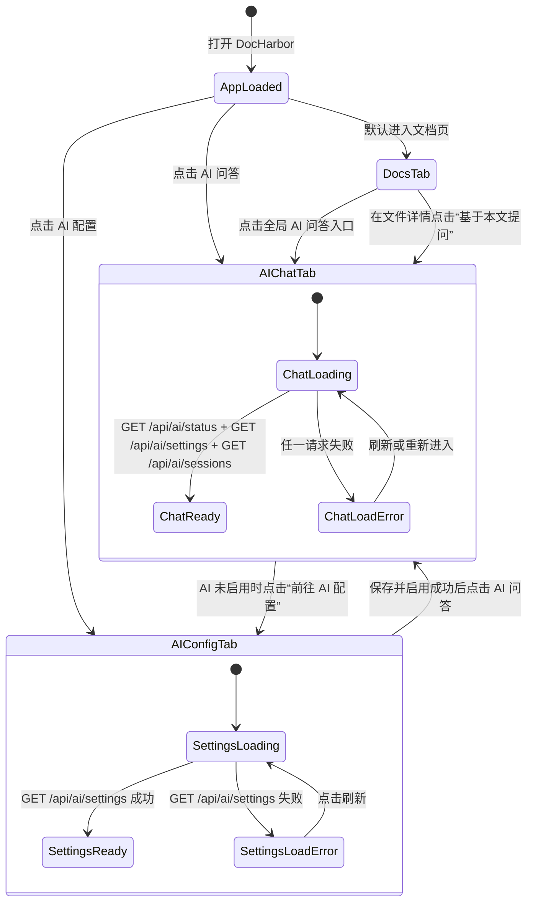
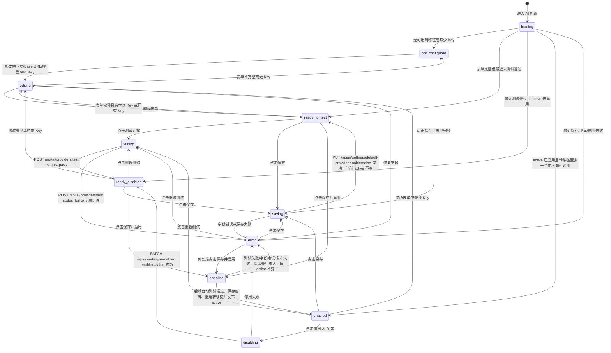
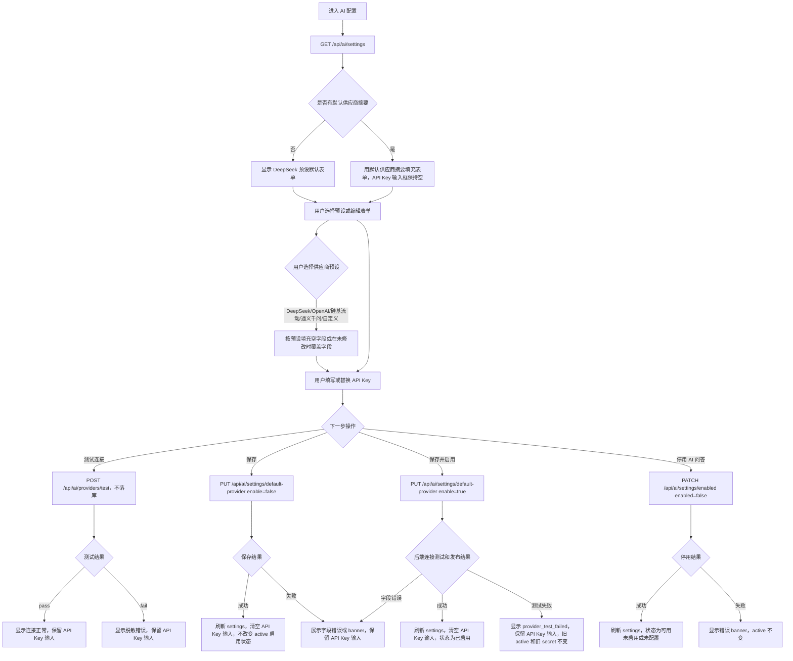
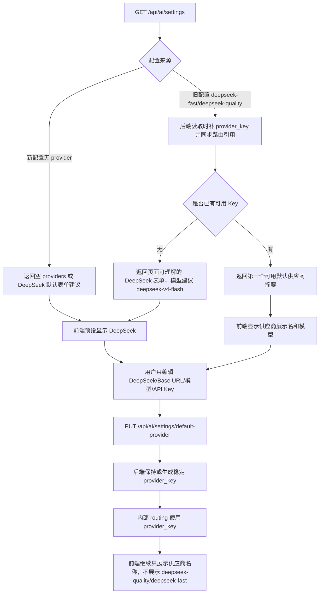
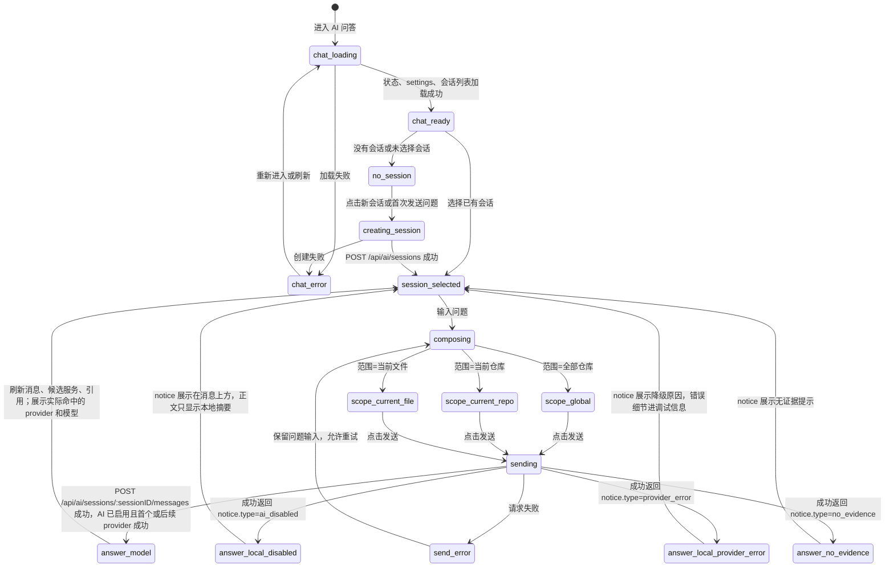
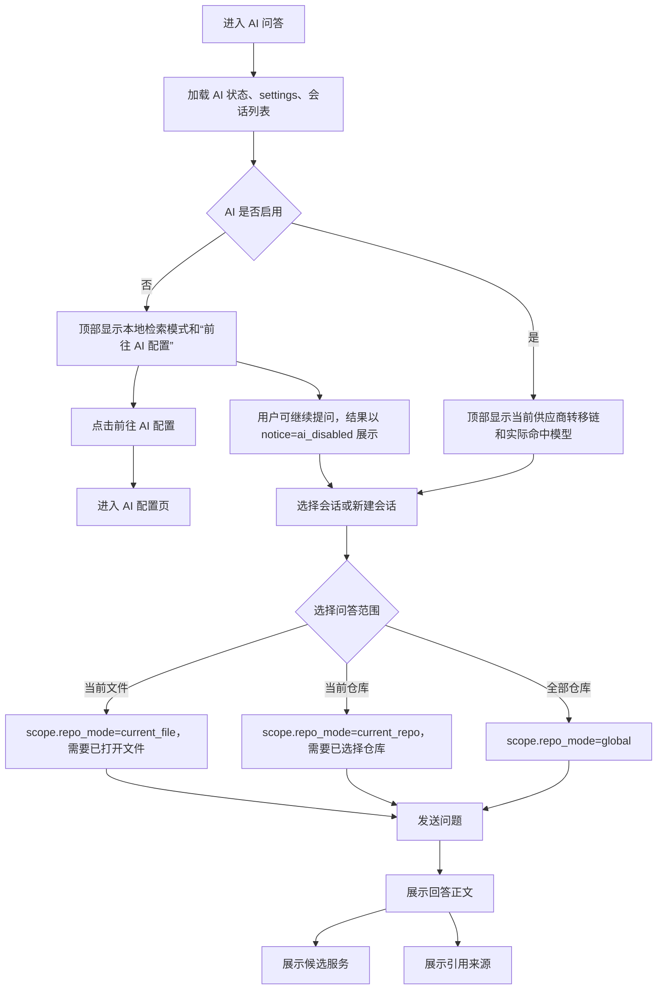
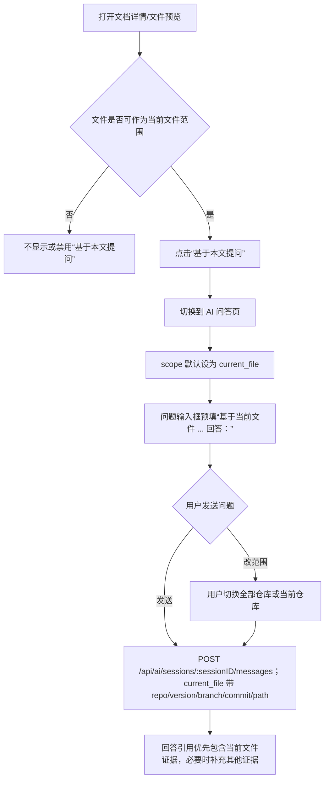
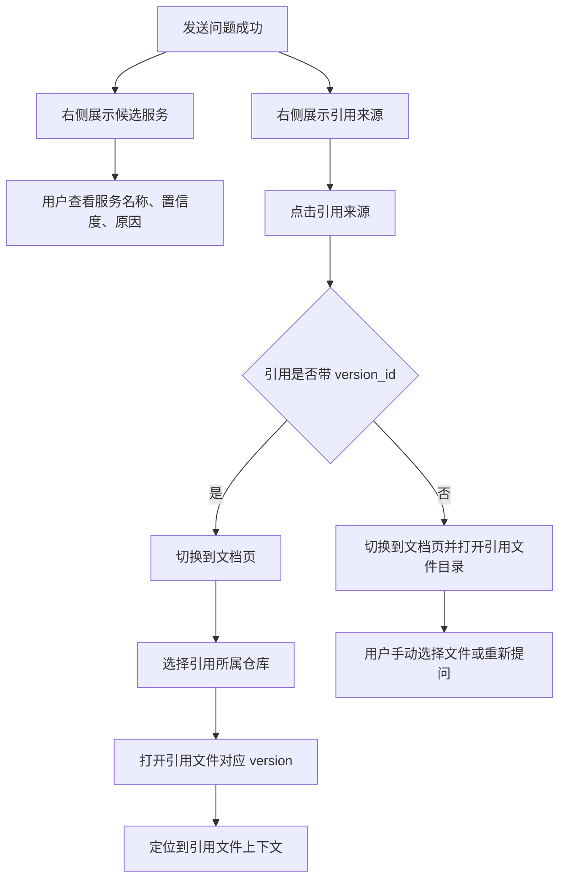
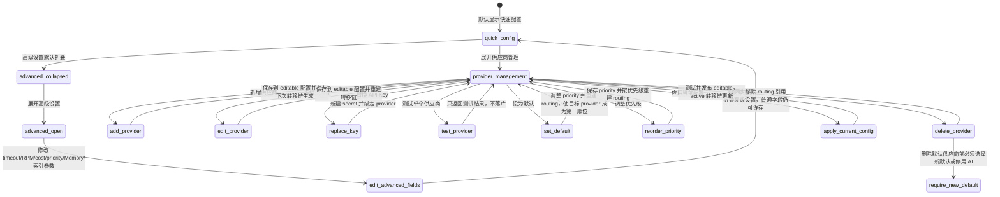

# DocHarbor AI 供应商配置重构设计文档

## 1. 文档目标

本文定义 DocHarbor AI 供应商配置页面和后端配置逻辑的重构方案。

这次重构要解决的核心问题是：当前页面把内部实现概念直接暴露给用户，包括 `api_key_secret_id`、草稿、发布、校验、provider 路由等，导致用户无法用“配置供应商并启用 AI”的自然流程完成配置。

重构后的目标是：

- AI 配置是全局系统能力，不按仓库配置。
- 首屏只暴露最小可用配置：供应商、模型、API Key、连接测试、保存并启用。
- DocHarbor 支持配置多个 AI 供应商；问答调用按优先级依次尝试，当前供应商失败时自动转移到下一个可用供应商。
- API Key 由后端加密保存，前端不展示、不要求用户理解 secret id。
- 内部仍可保留配置版本、校验、发布和密钥引用，但 UI 不把这些概念作为主流程。
- AI 未启用时，问答页明确展示配置入口，不把“供应商未启用”伪装成 AI 结论。

## 2. 已确认需求

| 问题 | 结论 |
| --- | --- |
| 供应商协议范围 | 首期只支持 OpenAI-compatible 供应商，覆盖 DeepSeek、OpenAI、硅基流动、通义千问兼容接口等 |
| 默认配置复杂度 | 首屏仍按“一个默认供应商 + 一个模型 + 一个 API Key”组织表单，但系统必须支持多个供应商同时启用 |
| 多供应商转移 | active 配置启用后，默认 task class 的供应商链按 `priority` 从小到大依次调用；前一个供应商失败时自动尝试下一个 |
| 高级设置 | Memory、索引参数、task class 路由、成本路由等先放到高级设置；基础供应商优先级转移不是高级功能，必须默认生效 |
| 配置作用域 | AI 供应商配置是全局配置，不属于某个仓库 |
| API Key 管理 | 页面只展示“未配置 / 已配置 / 尾号”，不展示 `api_key_secret_id` |
| 环境变量 | 不要求用户配置 `AI_SECRET_KEY`；后端继续使用 `DATA_DIR/secrets/ai-master.key` 自动本地加密主密钥 |

### 2.1 已锁定实现决策

以下决策在本次重构中固定，不留给实现阶段二次选择。

| 决策点 | 固定方案 |
| --- | --- |
| 新入口 | 新前端只调用 `/api/ai/settings`、`/api/ai/settings/default-provider`、`/api/ai/settings/apply`、`/api/ai/providers`、`/api/ai/providers/{provider_key}`、`/api/ai/providers/test`、`/api/ai/settings/enabled` |
| 旧入口 | `/api/ai/config/drafts/*` 和 `/api/ai/secrets` 仅保留兼容旧页面或诊断用途，不进入新 UI 主流程 |
| Provider 操作标识 | 使用 `provider_key`，不使用数据库自增 ID，不把 `api_key_secret_id` 暴露给前端 |
| Provider 展示名 | `name` 只做展示，用户可修改，路由不引用 `name` |
| Provider 路由引用 | `routing.task_classes[*].providers` 固定引用 `provider_key` |
| Provider 优先级 | `priority` 数字越小优先级越高；默认路由链必须按有效 priority 升序生成，`provider_key` 作为同 priority 的稳定排序键 |
| 配置落点 | Provider 仍保存在 `ai_config_versions.config_json`，本期不新增 `ai_providers` 表 |
| 密钥替换 | 保存新 API Key 时创建新 `ai_secrets` 记录，不覆盖旧 secret 的 `encrypted_value` |
| 测试连接 | 单独“测试连接”不写入 `ai_secrets`，不生成 draft，不改变 active |
| 保存 | “保存”只写可编辑配置，不发布 active，不启用或停用 AI |
| 保存并启用 | 必须先测试默认供应商成功，再保存密钥、重建优先级路由链并发布 active |
| 停用 AI | 通过 `/api/ai/settings/enabled` 发布 `enabled=false` 的新 active 配置，不删除密钥 |
| 失败恢复 | 校验失败配置进入 `failed`，新 UI 必须继续把它作为 editable 配置返回和编辑 |
| 问答转移和降级提示 | 每次问答记录实际命中的 provider；所有 provider 都失败时才降级本地摘要，失败链路走结构化字段，不拼进 `message.content` |

### 2.2 命名和枚举

#### Provider Key

`provider_key` 是后端生成的稳定字符串，规则固定如下：

1. 来源：新增 provider 时由后端根据 `name` 生成。
2. 格式：小写字母、数字、连字符；正则为 `^[a-z0-9][a-z0-9-]{1,62}[a-z0-9]$`。
3. 生成：先把展示名转为小写 slug；不能转换时使用 `provider`；如果冲突，追加 `-2`、`-3`，直到唯一。
4. 稳定性：编辑 `name`、`base_url`、`model`、API Key 时不改变 `provider_key`。
5. 旧数据：旧 provider 没有 `provider_key` 时，用旧 `name` 按同样规则补齐；旧路由里的 provider 名称同步映射到补齐后的 `provider_key`。

#### 状态枚举

`GET /api/ai/settings.status` 只能返回以下值：

| 值 | 含义 |
| --- | --- |
| `not_configured` | 没有 provider，或没有任何可路由 provider 具备 Base URL、模型、API Key |
| `ready_to_test` | 当前表单字段完整，但没有最近一次通过的测试 |
| `ready_disabled` | 最近一次测试通过，但 active 配置 `enabled=false` |
| `enabled` | active 配置 `enabled=true`，优先级路由链至少有一个可调用 provider |
| `error` | 最近一次保存、测试、校验或发布失败 |

前端按钮 loading 态使用本地状态，不写入后端 status。

## 3. 当前问题

### 3.1 用户流程断裂

当前页面要求用户分别完成：

1. 创建草稿。
2. 填写新 API key。
3. 单独点击 provider 的“保存 key”。
4. 勾选启用。
5. 保存草稿。
6. 校验。
7. 发布。

这个流程把内部保存顺序暴露给用户。只要漏掉“保存 key”，草稿里仍然是 `api_key_secret_id = 0`，启用时就会报：

```text
ai config validation failed: provider api_key_secret_id is required when AI is enabled: deepseek-fast
```

### 3.2 内部字段暴露

`Secret ID` 是后端密钥引用字段，不应该出现在普通配置页面。用户只需要知道某个 provider 是否已经绑定 API Key。

### 3.3 失败草稿体验差

校验或发布失败后，用户应该留在当前编辑态，看到字段级错误并继续修改。当前行为容易让用户感觉草稿消失或状态不可恢复。

### 3.4 AI 未启用提示位置错误

当供应商未启用时，问答页当前会把“AI 供应商未启用”写进回答正文。这会让用户误以为是 AI 给出的结论。正确做法是 UI 状态提示，而不是答案内容。

### 3.5 多供应商转移口径缺失

DocHarbor 需要同时配置多个 AI 供应商，并在问答调用时按优先级自动转移。设计必须明确：

- 多个 provider 如何排序。
- 哪些 provider 可以进入 active 路由链。
- 单次问答中什么错误会触发尝试下一个 provider。
- 所有 provider 失败时如何记录 `provider_failover_json` 并降级到本地检索摘要。

## 4. 设计原则

1. **全局配置**：AI 供应商、模型和密钥是 DocHarbor 实例级配置，不归属于某个仓库。
2. **主流程最短**：默认只需要填写供应商、模型、API Key，然后测试并启用。
3. **隐藏内部引用**：`secret_id`、配置版本、草稿状态、发布状态属于内部实现，首屏不展示。
4. **失败可恢复**：保存、测试、校验或启用失败后，页面必须保留用户输入和错误详情。
5. **基础容错默认开启**：多 provider 优先级转移是问答运行时基础能力，不要求用户理解 task class 或手写 routing JSON。
6. **先可用再高级**：先保证默认供应商和优先级转移链可用；Memory、索引参数、task class 路由和成本路由放进高级设置。
7. **状态表达清晰**：页面使用“未配置、可测试、可用未启用、已启用、配置错误”等产品状态，不让用户理解 `draft/failed/published`。
8. **密钥只写不读**：API Key 明文只在用户输入后提交到后端，后端加密保存；之后只返回尾号和配置状态。

## 5. 目标信息架构

AI 配置作为左侧全局入口之一，与仓库列表并列：

```text
DocHarbor
  新增仓库
  AI 问答
  AI 配置
  仓库列表
```

AI 配置页分为三块：

1. 当前状态
2. 快速配置
3. 高级设置

### 5.1 当前状态

展示 DocHarbor 当前 AI 能力是否可用。

| 后端 status | 页面状态 | 触发条件 | 页面文案 |
| --- | --- | --- | --- |
| `not_configured` | 未配置 | 没有 provider，或默认 provider 缺少 Base URL、模型、API Key | AI 尚未启用 |
| `ready_to_test` | 可测试 | 表单完整但没有通过测试 | 可以测试连接 |
| `ready_disabled` | 可用未启用 | 测试通过但当前 active 配置未启用 | 配置可用，尚未启用 |
| `enabled` | 已启用 | active 配置 `enabled=true` 且默认路由至少有一个可用 provider | AI 问答已启用 |
| `error` | 配置错误 | 最近一次保存、测试或启用失败 | 显示具体错误和修复入口 |

当前状态区展示：

- AI 启用状态。
- 当前默认供应商。
- 当前默认模型。
- 当前 active 供应商转移链：按 `active_route_provider_keys` 展示正在服务的 provider 名称和模型。
- 如存在未应用变更，额外展示 editable 转移链预览：按 `route_provider_keys` 展示保存后待应用的 provider 名称和模型。
- 最近一次连接测试结果。
- 密钥存储状态：本地数据目录已就绪 / 本地数据目录不可写。

不展示：

- `api_key_secret_id`
- 配置 hash
- draft/version/status
- routing JSON

默认供应商按以下顺序推导：

1. 读取 active 或可编辑配置的 `routing.default_task_class`，取该 task class 优先级路由链里的第一个可用 provider。
2. 如果路由缺失或指向的 provider 不存在，按 provider `priority` 从小到大取第一个已绑定 API Key 的 provider。
3. 如果都不可用，状态显示“未配置”或“配置错误”，不要静默改写 active 配置。

供应商转移链按以下顺序推导：

1. 优先读取 `routing.default_task_class` 对应 route 的 `providers`。
2. 过滤不存在、Base URL 为空、模型为空、未绑定 API Key 或 secret 不存在的 provider。
3. 如果 route 缺失或过滤后为空，按所有 provider 的 `priority` 升序重建候选链。
4. 链路中的第一个 provider 是页面上的“当前默认供应商”，后续 provider 是自动转移候选。
5. GET 接口只返回可读摘要，不返回完整 routing JSON。

“启用中”只作为按钮提交时的临时 loading 态，不作为已发布配置的持久状态。

## 6. 快速配置页面

### 6.1 表单字段

首屏只展示一组默认供应商配置，作为优先级路由链中的第一个入口。多个供应商的新增、排序和删除放在下方“供应商管理”区域，但发布后的问答运行时必须始终使用完整优先级路由链。

| 字段 | 必填 | 说明 | 示例 |
| --- | --- | --- | --- |
| 供应商名称 | 是 | 页面展示名称，默认可选预设；内部 `provider_key` 由后端生成并保持稳定 | DeepSeek |
| Base URL | 是 | OpenAI-compatible API 根地址，也兼容用户直接填写 `/chat/completions` 完整地址 | `https://api.deepseek.com` |
| 模型 | 是 | Chat Completions 模型名 | `deepseek-v4-flash` |
| API Key | 首次必填 | 新增或替换密钥；已配置时可留空表示不修改，前端不能把脱敏占位符当成新 key 提交 | `sk-...` |
| AI 问答开关 | 否 | 展示当前 active 是否启用；停用通过独立操作发布 `enabled=false` 配置 | 开启 |

高级字段默认折叠：

- 请求超时秒数。
- RPM 限制。
- 成本等级。
- 优先级。

### 6.2 供应商预设

页面提供预设下拉，用户选择后自动填充 Base URL 和推荐模型。

| 预设 | 默认 `provider_key` | Base URL | 推荐模型 | timeout | RPM | cost tier | priority |
| --- | --- | --- | --- | --- | --- | --- | --- |
| DeepSeek | `deepseek-main` | `https://api.deepseek.com` | `deepseek-v4-flash` | 60 | 60 | `medium` | 10 |
| OpenAI | `openai-main` | `https://api.openai.com/v1` | 空，由用户填写 | 60 | 60 | `medium` | 10 |
| 硅基流动 | `siliconflow-main` | `https://api.siliconflow.cn/v1` | 空，由用户填写 | 60 | 60 | `medium` | 10 |
| 通义千问兼容接口 | `qwen-main` | `https://dashscope.aliyuncs.com/compatible-mode/v1` | 空，由用户填写 | 60 | 60 | `medium` | 10 |
| 自定义 | 后端按名称生成 | 空，由用户填写 | 空，由用户填写 | 60 | 60 | `medium` | 10 |

预设只负责填默认值，不锁死字段。

预设切换规则固定如下：

1. 用户未手动修改字段时，选择预设会覆盖 `name`、`base_url`、`model`、`timeout_seconds`、`max_rpm`、`cost_tier`、`priority`。
2. 用户已手动修改字段时，前端只覆盖空字段；不覆盖用户已输入内容。
3. 已存在 provider 的 `provider_key` 不因切换预设而改变。
4. 新建 provider 时，如果预设默认 `provider_key` 已存在，后端按 `provider_key-2`、`provider_key-3` 生成唯一值。

### 6.3 主操作

首屏只保留主要操作和必要状态操作：

| 操作 | 行为 |
| --- | --- |
| 测试连接 | 使用当前表单和本次输入的 API Key 调用 OpenAI-compatible `/chat/completions` 做最小请求；默认不写入 `ai_secrets`，不生成可发布配置 |
| 保存 | 保存 provider、模型和 API Key 到可编辑配置，不发布 active 配置；当前已经启用的 AI 继续使用旧 active 配置 |
| 保存并启用 | 先用本次表单执行启用校验和连接测试，成功后再保存密钥、按 provider 优先级重建转移链、切换 active 配置并启用 AI |
| 停用 AI 问答 | 复制当前 active 配置并发布一份 `enabled=false` 的 active 配置，不删除 provider 和密钥 |

不再要求用户先点“保存 key”。

Base URL 规范化规则：

- 用户填写 provider 根地址时，后端自动拼接 `/chat/completions`。
- 用户已经填写完整 `/chat/completions` 地址时，后端不重复拼接。
- URL 必须是 `http` 或 `https` 且包含 host；保存并启用时非法 URL 返回字段级错误。

## 7. 多供应商管理

多供应商优先级转移是基础能力；“供应商管理”只是它的配置入口。即使用户只完成首屏快速配置，后端也要按同一套规则生成可扩展的路由链，后续新增 provider 后无需改问答调用逻辑。

### 7.0 优先级转移规则

`priority` 数字越小优先级越高。active 配置启用后，单次问答调用必须按以下顺序选择 provider：

1. 读取 `routing.default_task_class`，默认值为 `standard`。
2. 读取该 task class 的 `providers`，其顺序就是本次调用顺序。
3. 如果 route 缺失、为空或引用不可用 provider，后端按 provider `priority` 升序、`provider_key` 升序重建默认 route。
4. 只把可路由 provider 写入 active route：Base URL 非空、model 非空、`api_key_secret_id > 0` 且 secret 存在。
5. 同一 provider 在同一次问答中最多尝试一次。
6. 前一个 provider 调用失败后继续尝试下一个 provider；直到某个 provider 返回有效答案，或所有 provider 都失败。

会触发转移的失败包括：

- secret 解密失败。
- Base URL 规范化失败。
- 网络错误、超时、context deadline。
- HTTP 非 2xx。
- 响应不是合法 JSON。
- `choices[0].message.content` 为空。
- provider 返回限流、鉴权、模型不存在等错误。

不会继续转移的情况：

- 请求上下文已被客户端取消。
- active 配置 `enabled=false`。
- 检索阶段已经判定没有可发送给模型的证据且业务选择直接返回 `no_evidence`。

调用结果记录规则：

- 成功时，`message.provider_name` 和 `message.model` 记录实际成功的 provider，不一定是优先级第一的 provider。
- 成功时，`run.provider_failover_json` 仍记录成功前失败过的 provider；如果第一 provider 直接成功，`failures` 为空数组。
- 全部 provider 失败时，返回本地检索摘要，`notice.type=provider_error`，`model_route_json.reason=provider_error`。
- 所有失败详情必须脱敏，不能包含 API Key、Authorization header 或过长 provider 原始响应。

`provider_failover_json` 固定结构：

```json
{
  "attempt_order": ["deepseek-main", "openai-main", "qwen-main"],
  "succeeded_provider_key": "openai-main",
  "failures": [
    {
      "provider_key": "deepseek-main",
      "provider": "DeepSeek",
      "model": "deepseek-v4-flash",
      "priority": 10,
      "error": "provider returned 429: rate limit"
    }
  ]
}
```

全部失败时：

```json
{
  "attempt_order": ["deepseek-main", "openai-main"],
  "succeeded_provider_key": "",
  "error": "no AI provider completed successfully",
  "failures": [
    {
      "provider_key": "deepseek-main",
      "provider": "DeepSeek",
      "model": "deepseek-v4-flash",
      "priority": 10,
      "error": "provider returned 401: unauthorized"
    },
    {
      "provider_key": "openai-main",
      "provider": "OpenAI",
      "model": "gpt-4.1-mini",
      "priority": 20,
      "error": "request timeout"
    }
  ]
}
```

### 7.1 供应商列表

每个供应商卡片展示：

- 名称。
- Base URL。
- 模型。
- 优先级。
- 调用顺序。
- 是否已配置 API Key。
- API Key 尾号。
- 最近测试状态。
- 是否为默认供应商。
- 是否在当前 active 转移链中。

卡片操作：

- 编辑。
- 测试。
- 设为默认。
- 调整优先级。
- 删除。
- 替换 API Key。

编辑或删除 provider 时必须同步维护路由：

- 修改 provider 展示名称不影响路由；如果诊断工具允许修改内部 `provider_key`，后端必须在同一份可编辑配置中同步更新 `routing.task_classes[*].providers` 引用。
- 删除当前转移链第一个 provider 前必须先指定新的默认 provider，或明确停用 AI。
- 调整优先级后，后端必须重建默认 task class 的 provider 顺序；前端不能只改列表排序而不保存配置。
- AI 已启用时不能发布一个默认路由为空、或默认路由只包含无密钥 provider 的配置。
- 未配置 API Key 的 provider 可以保存在列表中，但不得进入 active 转移链。

### 7.2 新增或编辑供应商

新增供应商表单字段：

| 字段 | 必填 | 默认 |
| --- | --- | --- |
| 名称 | 是 | 预设名称或用户输入 |
| Provider Key | 是 | 后端按名称自动生成，首期不展示 |
| Provider Type | 是 | 固定 `openai_compatible`，首期不展示 |
| Base URL | 是 | 按预设填充 |
| 模型 | 是 | 按预设填充或用户输入 |
| API Key | 新增必填 | 空 |
| 超时秒数 | 否 | 60 |
| RPM | 否 | 60 |
| 优先级 | 否 | 自动计算；数字越小越优先 |

编辑已有供应商时：

- API Key 输入框为空表示不修改。
- 用户填入新 API Key 表示替换。
- 页面不显示旧 API Key 明文。

## 8. 高级设置

高级设置默认折叠，面向后续复杂场景。基础 provider 优先级转移不属于高级设置，不提供关闭开关。

### 8.1 路由策略

默认不展示 task class 和原始 routing JSON。高级设置中可编辑的是任务类型路由，不影响基础 provider 优先级转移必须可用的要求。

普通用户可见配置：

- 默认供应商，即当前转移链第一个 provider。
- provider 优先级，即当前转移链排序依据。

高级设置中可编辑：

- cheap / standard / reasoning 任务路由。
- 不同 task class 的候选 provider 集合。
- 自动升级条件。
- 成本路由策略。

首期固定生成内部默认路由：

```text
standard -> 所有可路由供应商，按 priority 从小到大排序
```

路由仍然以 provider key 引用 provider。快速配置保存默认 provider 或供应商管理调整优先级时，后端需要重写默认 task class 的 provider 列表，避免页面展示顺序和实际模型调用顺序不一致。

快速配置生成的 `routing` 固定为：

```json
{
  "default_task_class": "standard",
  "task_classes": {
    "standard": {
      "providers": ["deepseek-main", "openai-main"],
      "fallback_task_class": ""
    }
  },
  "escalation": {}
}
```

当有多个可路由 provider 时，`standard.providers` 固定按 `priority` 从小到大排序；同优先级按 `provider_key` 升序排序。页面上的“设为默认”必须通过调整该 provider 的 `priority` 并归一化冲突，使它成为 `standard.providers[0]`。隐藏的高级路由字段不再生成 `cheap`、`reasoning` 默认路由，避免默认配置引用不存在或未配置密钥的 provider。

### 8.2 Memory

默认折叠，字段包括：

- 是否启用 Memory。
- 是否需要人工确认。
- 保留天数。
- 最大上下文条数。
- 最小置信度。

### 8.3 索引和检索

默认折叠，字段包括：

- 最大索引文件大小。
- 最大证据片段数量。
- chunk 大小。
- 是否启用功能分支候选。

这些字段不应阻塞普通供应商启用流程。

## 9. 后端接口设计

当前底层接口必须保留为兼容入口，同时新增面向 UI 的简化接口。前端优先调用简化接口，不再直接依赖 `/api/ai/config/drafts/*`、`/api/ai/secrets` 和 `api_key_secret_id`。

### 9.0 通用接口约定

所有新接口固定使用 JSON。

| 项 | 规则 |
| --- | --- |
| 请求头 | `Content-Type: application/json` |
| 成功响应 | HTTP `200` 或 `201`，返回 JSON object |
| 字段级错误 | HTTP `400`，返回 `error.code=validation_failed` 和 `fields` |
| 未找到 provider | HTTP `404`，返回 `error.code=provider_not_found` |
| 密钥不可用 | HTTP `503`，返回 `error.code=encryption_unavailable` |
| 连接测试失败 | 单独测试接口返回 HTTP `200` + `status=fail`；保存并启用返回 HTTP `400` + `error.code=provider_test_failed` |
| 时间格式 | RFC3339 UTC 字符串，例如 `2026-06-28T08:00:00Z` |
| API Key 回显 | 所有 GET 和错误响应都不得返回明文 `api_key` 或 `encrypted_value` |

字段级错误固定格式：

```json
{
  "error": {
    "code": "validation_failed",
    "message": "配置不完整"
  },
  "fields": {
    "base_url": "Base URL 不能为空",
    "model": "模型不能为空",
    "api_key": "首次启用必须填写 API Key"
  }
}
```

非字段错误固定格式：

```json
{
  "error": {
    "code": "provider_test_failed",
    "message": "供应商连接测试失败",
    "detail": "provider returned 401: unauthorized"
  }
}
```

`detail` 只能放脱敏后的安全摘要，必须过滤以下内容：

- `Authorization` header。
- API Key 明文和疑似 `sk-` 开头 token。
- provider 返回体里超过 500 字符的内容。

### 9.1 获取 AI 配置摘要

```http
GET /api/ai/settings
```

查询参数：无。

响应字段：

| 字段 | 类型 | 必返 | 说明 |
| --- | --- | --- | --- |
| `enabled` | boolean | 是 | 当前 active 配置是否启用 |
| `status` | string | 是 | 只能是 2.2 中定义的 5 个 status |
| `default_provider_key` | string | 否 | 无默认 provider 时为空字符串 |
| `default_provider_name` | string | 否 | 默认 provider 展示名 |
| `default_model` | string | 否 | 默认模型 |
| `route_provider_keys` | array | 是 | 当前可编辑配置的默认 task class 可读转移链 provider key，按保存后的调用顺序返回 |
| `route_providers` | array | 是 | 当前可编辑配置的默认 task class 可读转移链摘要，只包含 provider key、名称、模型和优先级，不返回 routing JSON |
| `active_route_provider_keys` | array | 是 | 当前 active 配置正在服务的 provider key 调用链 |
| `has_unapplied_changes` | boolean | 是 | 是否存在尚未发布到 active 的 editable 配置 |
| `encryption_ready` | boolean | 是 | `aiMasterKey()` 是否可用 |
| `editable_status` | string | 否 | `draft`、`failed` 或空字符串 |
| `last_test` | object | 否 | 默认 provider 最近一次测试摘要 |
| `providers` | array | 是 | provider 摘要列表，按当前调用顺序优先、其余按 priority 排序 |

Provider 摘要字段：

| 字段 | 类型 | 必返 | 说明 |
| --- | --- | --- | --- |
| `provider_key` | string | 是 | provider 稳定键 |
| `name` | string | 是 | 展示名 |
| `provider_type` | string | 是 | 固定 `openai_compatible` |
| `base_url` | string | 是 | 保存的 Base URL，不返回拼接后的 chat URL |
| `model` | string | 是 | Chat model |
| `api_key_configured` | boolean | 是 | 是否有有效 `api_key_secret_id` 且 secret 存在 |
| `api_key_last4` | string | 否 | 已配置时返回 |
| `is_default` | boolean | 是 | 是否默认 provider |
| `route_order` | number | 是 | 当前 active/editable 转移链中的调用顺序；不在链路中为 0 |
| `usable` | boolean | 是 | Base URL、model、API Key 都可用 |
| `last_test_status` | string | 否 | `pass`、`fail`、`not_run` |
| `last_test_message` | string | 否 | 脱敏测试摘要 |
| `timeout_seconds` | number | 是 | 请求超时 |
| `max_rpm` | number | 是 | RPM 限制 |
| `priority` | number | 是 | 路由排序 |

响应：

```json
{
  "enabled": true,
  "status": "enabled",
  "default_provider_key": "deepseek-main",
  "default_provider_name": "DeepSeek",
  "default_model": "deepseek-v4-flash",
  "route_provider_keys": ["deepseek-main", "openai-main"],
  "active_route_provider_keys": ["deepseek-main"],
  "has_unapplied_changes": true,
  "route_providers": [
    {
      "provider_key": "deepseek-main",
      "name": "DeepSeek",
      "model": "deepseek-v4-flash",
      "priority": 10
    },
    {
      "provider_key": "openai-main",
      "name": "OpenAI",
      "model": "gpt-4.1-mini",
      "priority": 20
    }
  ],
  "encryption_ready": true,
  "editable_status": "draft",
  "last_test": {
    "status": "pass",
    "tested_at": "2026-06-28T08:00:00Z",
    "message": "连接正常"
  },
  "providers": [
    {
      "provider_key": "deepseek-main",
      "name": "DeepSeek",
      "provider_type": "openai_compatible",
      "base_url": "https://api.deepseek.com",
      "model": "deepseek-v4-flash",
      "api_key_configured": true,
      "api_key_last4": "abcd",
      "is_default": true,
      "route_order": 1,
      "usable": true,
      "last_test_status": "pass",
      "last_test_message": "连接正常",
      "timeout_seconds": 60,
      "max_rpm": 60,
      "priority": 10
    },
    {
      "provider_key": "openai-main",
      "name": "OpenAI",
      "provider_type": "openai_compatible",
      "base_url": "https://api.openai.com/v1",
      "model": "gpt-4.1-mini",
      "api_key_configured": true,
      "api_key_last4": "wxyz",
      "is_default": false,
      "route_order": 2,
      "usable": true,
      "last_test_status": "pass",
      "last_test_message": "连接正常",
      "timeout_seconds": 60,
      "max_rpm": 60,
      "priority": 20
    }
  ]
}
```

### 9.2 保存快速配置

```http
PUT /api/ai/settings/default-provider
```

请求字段：

| 字段 | 类型 | 必填 | 规则 |
| --- | --- | --- | --- |
| `provider_key` | string | 否 | 为空表示创建或覆盖当前默认 provider；非空必须存在于 editable 或 active 配置 |
| `name` | string | 是 | 1 到 80 个字符，前后空白会 trim |
| `base_url` | string | 是 | 必须是合法 `http` 或 `https` URL |
| `model` | string | 是 | 1 到 120 个字符，前后空白会 trim |
| `api_key` | string | 否 | 新增或替换 API Key；空字符串表示不修改 |
| `enable` | boolean | 是 | true 表示保存并启用；false 表示仅保存 |
| `timeout_seconds` | number | 否 | 缺省 60，范围 5 到 300 |
| `max_rpm` | number | 否 | 缺省 60，范围 1 到 10000 |
| `priority` | number | 否 | 缺省 10，范围 1 到 10000 |
| `cost_tier` | string | 否 | `low`、`medium`、`high`，缺省 `medium` |

请求：

```json
{
  "provider_key": "deepseek-main",
  "name": "DeepSeek",
  "base_url": "https://api.deepseek.com",
  "model": "deepseek-v4-flash",
  "api_key": "sk-...",
  "enable": true,
  "timeout_seconds": 60,
  "max_rpm": 60
}
```

规则：

- `provider_key` 为空时表示创建或覆盖当前默认 provider；非空时表示编辑指定 provider。
- `api_key` 非空时，后端新建一条 `ai_secrets` 记录并把可编辑配置绑定到新 secret；不要原地更新已被 active 或历史版本引用的 secret。
- `api_key` 为空且 provider 已有密钥时，不修改密钥。
- `api_key` 为空且 provider 没有密钥时，返回字段级错误。
- `enable=true` 时，先执行字段校验和连接测试；通过后再保存新密钥、校验配置并发布 active 配置。
- `enable=true` 且连接测试失败时，不发布 active 配置，也不替换当前 active 正在引用的密钥。
- `enable=true` 发布前必须按所有可路由 provider 的 `priority` 升序重建 `standard.providers`；不能只发布当前表单 provider。
- `enable=false` 时，只保存可编辑配置，不发布 active 配置，也不关闭当前已经启用的 AI。

`enable=true` 的固定执行顺序：

1. 校验请求字段，不访问数据库。
2. 读取 editable 配置；如果没有 editable，则从 active 复制一份内存配置。
3. 合并本次 provider 字段，但暂不写库。
4. 使用本次 `api_key` 或已有 secret 解密出的 key 执行连接测试。
5. 连接测试失败则返回 `provider_test_failed`，不写入 `ai_secrets`，不写入 `ai_config_versions`。
6. 连接测试通过后，如果本次 `api_key` 非空，创建新 secret。
7. 把 provider 的 `api_key_secret_id` 指向新 secret 或旧 secret。
8. 收集所有可路由 provider，按 `priority` 升序和 `provider_key` 升序生成默认 routing。
9. 在一个事务中写入/更新 draft、校验通过、supersede 旧 active、发布新 active。

`enable=false` 的固定执行顺序：

1. 校验请求字段。
2. 读取或创建 editable 配置。
3. 如果 `api_key` 非空，创建新 secret 并绑定 provider。
4. 保存 editable 配置，状态为 `draft`，`validation_status=not_run`。
5. 返回最新 settings 摘要；不触碰 active。

响应必须包含 `settings`，用于前端保存后刷新：

```json
{
  "enabled": true,
  "provider": {
    "provider_key": "deepseek-main",
    "name": "DeepSeek",
    "model": "deepseek-v4-flash",
    "api_key_configured": true,
    "api_key_last4": "abcd"
  },
  "settings": {
    "enabled": true,
    "status": "enabled",
    "default_provider_key": "deepseek-main",
    "default_provider_name": "DeepSeek",
    "default_model": "deepseek-v4-flash",
    "route_provider_keys": ["deepseek-main"],
    "active_route_provider_keys": ["deepseek-main"],
    "has_unapplied_changes": false,
    "route_providers": [
      {
        "provider_key": "deepseek-main",
        "name": "DeepSeek",
        "model": "deepseek-v4-flash",
        "priority": 10
      }
    ],
    "encryption_ready": true,
    "editable_status": "",
    "providers": [
      {
        "provider_key": "deepseek-main",
        "name": "DeepSeek",
        "provider_type": "openai_compatible",
        "base_url": "https://api.deepseek.com",
        "model": "deepseek-v4-flash",
        "api_key_configured": true,
        "api_key_last4": "abcd",
        "is_default": true,
        "route_order": 1,
        "usable": true,
        "last_test_status": "pass",
        "last_test_message": "连接正常",
        "timeout_seconds": 60,
        "max_rpm": 60,
        "priority": 10
      }
    ]
  },
  "message": "AI 问答已启用"
}
```

### 9.3 测试供应商连接

```http
POST /api/ai/providers/test
```

请求字段：

| 字段 | 类型 | 必填 | 规则 |
| --- | --- | --- | --- |
| `provider_key` | string | 否 | 用已有密钥测试时必填 |
| `name` | string | 否 | 仅用于日志和响应 |
| `base_url` | string | 是 | 当前表单 Base URL |
| `model` | string | 是 | 当前表单模型 |
| `api_key` | string | 否 | 填了则优先使用明文测试 |
| `timeout_seconds` | number | 否 | 缺省 20，范围 5 到 60 |

请求：

```json
{
  "provider_key": "deepseek-main",
  "name": "DeepSeek",
  "base_url": "https://api.deepseek.com",
  "model": "deepseek-v4-flash",
  "api_key": "sk-..."
}
```

规则：

- 如果传入 `api_key`，使用该明文 key 做本次测试，并在用户确认保存前不落库。
- 如果未传入 `api_key` 且 `provider_key` 已有密钥，后端解密已有密钥测试。
- 测试请求使用最小 prompt，例如 `ping`，并限制 `max_tokens`，避免一次测试产生不可控成本。
- 测试失败返回 provider 原始错误的安全摘要，不返回完整密钥或敏感 header。
- 新前端只调用 `/api/ai/providers/test` 做测试；`POST /api/ai/providers` 固定用于新增供应商，不能再作为测试入口，避免请求语义冲突。

响应：

```json
{
  "status": "pass",
  "message": "连接正常",
  "model": "deepseek-v4-flash",
  "latency_ms": 860
}
```

失败响应也使用 HTTP `200`：

```json
{
  "status": "fail",
  "message": "供应商返回 401，请检查 API Key",
  "model": "deepseek-v4-flash",
  "latency_ms": 430,
  "safe_error": "provider returned 401: unauthorized"
}
```

### 9.4 供应商 CRUD

```http
POST /api/ai/providers
PATCH /api/ai/providers/{provider_key}
DELETE /api/ai/providers/{provider_key}
```

这些接口本期固定映射到底层配置版本表，不新增独立 provider 表。接口语义必须是 provider 级别，而不是让前端直接编辑整份配置 JSON。

CRUD 接口只修改可编辑配置：

- 如果已有 `draft` 或 `failed` 配置，直接在该配置上修改。
- 如果没有可编辑配置，后端从 active 配置复制一份 draft 后再修改。
- 删除、修改内部 `provider_key`、设为默认、调整优先级必须同步更新路由引用和默认转移链顺序。
- 新增或编辑 provider 后，如果该 provider 已具备 Base URL、model 和 API Key，保存时必须能进入下一次发布的转移链。
- CRUD 成功只代表 editable 已保存；active 仍按旧配置服务，直到调用 `/api/ai/settings/apply`。
- 所有 CRUD 成功响应都必须返回完整 `settings`，且 `settings.has_unapplied_changes=true`。

本期前端首屏不需要调用 CRUD；只在“供应商管理”展开后调用。但多供应商优先级转移属于首期运行时能力，不能因为首屏只配置一个 provider 而把问答调用写成单 provider。

#### 9.4.1 新增供应商

```http
POST /api/ai/providers
```

请求字段：

| 字段 | 类型 | 必填 | 规则 |
| --- | --- | --- | --- |
| `name` | string | 是 | 1 到 80 个字符 |
| `base_url` | string | 是 | OpenAI-compatible 根地址或完整 `/chat/completions` 地址 |
| `model` | string | 是 | 1 到 120 个字符 |
| `api_key` | string | 是 | 新增供应商必须提供；保存后只返回尾号 |
| `timeout_seconds` | number | 否 | 缺省 60，范围 5 到 300 |
| `max_rpm` | number | 否 | 缺省 60，范围 1 到 10000 |
| `priority` | number | 否 | 缺省为当前最大 priority + 10；范围 1 到 10000 |
| `cost_tier` | string | 否 | `low`、`medium`、`high` |
| `test_before_save` | boolean | 否 | true 时先测试连接，测试失败则不保存 |

请求：

```json
{
  "name": "OpenAI",
  "base_url": "https://api.openai.com/v1",
  "model": "gpt-4.1-mini",
  "api_key": "sk-...",
  "priority": 20,
  "test_before_save": true
}
```

规则：

- 后端生成唯一 `provider_key`。
- `test_before_save=true` 且连接失败时，返回 `provider_test_failed`，不创建 secret，不写 editable。
- `test_before_save=false` 时允许只做字段校验后保存；provider 进入 editable，但最近测试状态为 `not_run`。
- 保存成功后创建新 `ai_secrets`，provider 绑定新 secret。
- 如果 provider 可路由，后端按 priority 重建 editable 的 `route_provider_keys`。

响应示例省略未变化字段；真实响应必须返回完整 `settings`：

```json
{
  "provider": {
    "provider_key": "openai-main",
    "name": "OpenAI",
    "model": "gpt-4.1-mini",
    "api_key_configured": true,
    "api_key_last4": "wxyz",
    "priority": 20,
    "route_order": 2
  },
  "settings": {
    "has_unapplied_changes": true,
    "route_provider_keys": ["deepseek-main", "openai-main"]
  },
  "message": "供应商已保存，尚未应用到 AI 问答"
}
```

#### 9.4.2 编辑供应商和替换 Key

```http
PATCH /api/ai/providers/{provider_key}
```

请求字段全部可选，但至少提交一个字段：

| 字段 | 类型 | 规则 |
| --- | --- | --- |
| `name` | string | 更新展示名，不改变 `provider_key` |
| `base_url` | string | 更新 Base URL |
| `model` | string | 更新模型 |
| `api_key` | string | 非空表示替换 Key；空字符串或缺省表示不修改 |
| `timeout_seconds` | number | 5 到 300 |
| `max_rpm` | number | 1 到 10000 |
| `priority` | number | 1 到 10000 |
| `cost_tier` | string | `low`、`medium`、`high` |
| `make_default` | boolean | true 时把该 provider 调整为第一顺位 |
| `test_before_save` | boolean | true 时使用本次字段和 Key 测试，通过后才保存 |

请求：

```json
{
  "model": "gpt-4.1",
  "priority": 5,
  "make_default": true
}
```

规则：

- 修改 `name` 不影响路由引用。
- 替换 `api_key` 必须创建新 secret，不覆盖旧 secret。
- `make_default=true` 时，后端按 10.8 的规则调整并归一化 priority。
- 修改 `base_url`、`model`、`api_key`、`priority` 后必须重建 editable 转移链。
- 如果修改导致 provider 不可路由，它保留在列表中，但 `route_order=0`，不会进入 active route。
- active 不会被本接口修改。

响应同新增供应商，必须返回更新后的 `provider` 和完整 `settings`。

#### 9.4.3 删除供应商

```http
DELETE /api/ai/providers/{provider_key}?replacement_provider_key=openai-main
```

查询参数：

| 字段 | 必填 | 规则 |
| --- | --- | --- |
| `replacement_provider_key` | 条件必填 | 删除第一顺位 provider 且 AI 仍启用时必须提供；目标 provider 必须可路由 |

规则：

- 删除非第一顺位 provider：直接从 editable providers 移除，并同步移除 routing 引用。
- 删除第一顺位 provider：必须提供 `replacement_provider_key`，后端先把 replacement 调整为第一顺位，再删除目标 provider。
- 如果没有可用 replacement，接口返回字段错误 `replacement_provider_key`，前端提示用户先新增供应商或停用 AI。
- 删除 provider 不删除历史 `ai_secrets`。
- active 不会被本接口修改；删除生效到问答运行时必须再调用 `/api/ai/settings/apply`。

响应示例省略未变化字段；真实响应必须返回完整 `settings`：

```json
{
  "deleted_provider_key": "deepseek-main",
  "settings": {
    "has_unapplied_changes": true,
    "route_provider_keys": ["openai-main"]
  },
  "message": "供应商已删除，尚未应用到 AI 问答"
}
```

### 9.5 应用当前 AI 配置

```http
POST /api/ai/settings/apply
```

该接口把当前 editable 配置发布为 active，用于供应商管理完成新增、编辑、排序或删除后的“应用并启用当前配置”。

请求字段：

| 字段 | 类型 | 必填 | 规则 |
| --- | --- | --- | --- |
| `enabled` | boolean | 否 | 缺省 true；true 表示发布后启用 AI |
| `test_policy` | string | 否 | `default_only`、`changed_routable`、`all_routable`，缺省 `default_only` |

请求：

```json
{
  "enabled": true,
  "test_policy": "default_only"
}
```

规则：

- 没有 editable 配置时，从 active 配置计算并返回当前 settings，不创建新版本。
- `enabled=true` 时，默认转移链必须至少有一个可路由 provider。
- `default_only` 至少测试 `route_provider_keys[0]`，通过后可发布。
- `changed_routable` 测试本次 editable 中新增或修改过的可路由 provider。
- `all_routable` 测试所有 `route_provider_keys` 中的 provider；任一失败则不发布。
- 测试失败时不切换 active，返回 `provider_test_failed` 和按 provider_key 组织的脱敏错误。
- 发布成功后，清空 editable 状态或把 editable version 转为 active，`has_unapplied_changes=false`。

测试失败响应：

```json
{
  "error": {
    "code": "provider_test_failed",
    "message": "供应商连接测试失败"
  },
  "provider_errors": {
    "deepseek-main": "provider returned 401: unauthorized"
  },
  "settings": {
    "has_unapplied_changes": true,
    "active_route_provider_keys": ["openai-main"],
    "route_provider_keys": ["deepseek-main", "openai-main"]
  }
}
```

响应示例省略未变化字段；真实响应必须返回完整 `settings`：

```json
{
  "enabled": true,
  "settings": {
    "status": "enabled",
    "has_unapplied_changes": false,
    "active_route_provider_keys": ["deepseek-main", "openai-main"],
    "route_provider_keys": ["deepseek-main", "openai-main"]
  },
  "message": "当前 AI 配置已应用"
}
```

### 9.6 停用 AI 问答

```http
PATCH /api/ai/settings/enabled
```

请求：

```json
{
  "enabled": false
}
```

规则：

- 停用只发布一份 `enabled=false` 的 active 配置。
- 不删除 provider，不删除 `ai_secrets`，不清空历史配置版本。
- 停用后问答页进入本地检索摘要模式。

停用响应固定返回完整 settings 摘要。

## 10. 后端数据设计

### 10.1 保留配置版本

继续保留 `ai_config_versions`，用于：

- active 配置快照。
- 问答 run 绑定配置版本。
- 回滚和审计。

但 UI 不直接展示 draft/version/publish。

### 10.2 Provider 标识

首期不新增 `ai_providers` 表，也不向前端暴露数据库自增 ID。简化接口使用 `provider_key` 作为 provider 级操作标识。

首期在 `config_json.chat.providers[]` 中增加稳定的 `provider_key` 字段，`name` 保持为页面展示名：

- `provider_key` 必须非空、全局唯一，作为路由引用键使用。
- `name` 是页面展示名，允许用户修改，不影响路由。
- 修改 `provider_key` 属于诊断级操作，后端必须在同一配置版本内同步改写路由引用。
- 兼容旧配置时，如果 provider 没有 `provider_key`，后端从旧 `name` 生成并在下次保存时补齐。
- 本期之后如果新增独立 provider 表，后端只能把 `provider_key` 映射为内部数字 ID；外部接口不变更。

配置仍保存在 `config_json` 中，provider 对象示例：

```json
{
  "provider_key": "deepseek-main",
  "name": "DeepSeek",
  "provider_type": "openai_compatible",
  "base_url": "https://api.deepseek.com",
  "model": "deepseek-v4-flash",
  "api_key_secret_id": 12
}
```

### 10.3 密钥存储

继续使用 `ai_secrets`：

- `id`
- `name`
- `secret_type`
- `encrypted_value`
- `fingerprint`
- `last4`
- `created_by_viewer`
- `updated_by_viewer`
- `created_at`
- `updated_at`

密钥主密钥仍由后端自动管理：

```text
DATA_DIR/secrets/ai-master.key
```

要求：

- 文件权限 `0600`。
- 目录权限 `0700`。
- 不要求部署者配置 `AI_SECRET_KEY`。

密钥替换规则：

- 新 UI 替换 provider API Key 时默认创建新 `ai_secrets` 记录，并让新配置版本引用新 secret。
- 不原地覆盖已经被 active、superseded 或历史 run 绑定配置引用的 `encrypted_value`。
- 未被任何配置引用的旧 secret 本期不清理；安全清理另起任务处理。

### 10.4 连接测试结果

连接测试结果不写入 `config_json`，避免只测试连接也改变配置 hash。

存储策略固定如下：

- 未保存表单的测试结果只在接口响应和前端状态中存在。
- 保存或发布时产生的测试摘要写入 `validation_report_json`，按 `provider_key` 记录 `status`、`message`、`tested_at`、`latency_ms`。
- 发布 active 时同时写入本次生成的 `route_provider_keys`，便于诊断实际转移链。
- `GET /api/ai/settings` 的 `last_test` 和 provider `last_test_*` 从最近一次可用的 `validation_report_json` 或当前页面临时测试结果推导。

`validation_report_json` 中连接测试摘要固定结构：

```json
{
  "ok": true,
  "errors": [],
  "route_provider_keys": ["deepseek-main", "openai-main"],
  "provider_tests": {
    "deepseek-main": {
      "status": "pass",
      "message": "连接正常",
      "tested_at": "2026-06-28T08:00:00Z",
      "latency_ms": 860
    }
  }
}
```

### 10.5 类型变更

Go 模型必须增加 `ProviderKey` 字段：

```go
type AIProvider struct {
    ProviderKey           string `json:"provider_key"`
    Name                  string `json:"name"`
    Priority              int    `json:"priority"`
    ProviderType          string `json:"provider_type"`
    BaseURL               string `json:"base_url"`
    APIKeySecretID        int64  `json:"api_key_secret_id"`
    Model                 string `json:"model"`
    CostTier              string `json:"cost_tier"`
    RequestTimeoutSeconds int    `json:"request_timeout_seconds"`
    MaxRPM                int    `json:"max_rpm"`
    SecretConfigured      bool   `json:"secret_configured,omitempty"`
    SecretLast4           string `json:"secret_last4,omitempty"`
    SecretFingerprint     string `json:"secret_fingerprint,omitempty"`
}
```

TypeScript 类型必须同步：

```ts
export interface AIProvider {
  provider_key: string
  name: string
  priority: number
  provider_type: 'openai_compatible'
  base_url: string
  api_key_secret_id: number
  model: string
  cost_tier: 'low' | 'medium' | 'high'
  request_timeout_seconds: number
  max_rpm: number
  secret_configured?: boolean
  secret_last4?: string
  secret_fingerprint?: string
}
```

新前端不得直接使用 `AIProvider.api_key_secret_id`。该字段只用于旧接口兼容和后端内部配置版本。

Settings 响应类型必须包含可读转移链摘要：

```ts
export interface AISettingsRouteProvider {
  provider_key: string
  name: string
  model: string
  priority: number
}

export interface AISettingsProviderSummary {
  provider_key: string
  name: string
  provider_type: 'openai_compatible'
  base_url: string
  model: string
  api_key_configured: boolean
  api_key_last4?: string
  is_default: boolean
  route_order: number
  usable: boolean
  last_test_status?: 'pass' | 'fail' | 'not_run'
  last_test_message?: string
  timeout_seconds: number
  max_rpm: number
  priority: number
  cost_tier: 'low' | 'medium' | 'high'
}

export interface AISettingsSummary {
  enabled: boolean
  status: AISettingsStatus
  default_provider_key: string
  default_provider_name: string
  default_model: string
  route_provider_keys: string[]
  route_providers: AISettingsRouteProvider[]
  active_route_provider_keys: string[]
  has_unapplied_changes: boolean
  encryption_ready: boolean
  editable_status?: string
  last_test?: AIProviderTestSummary
  providers: AISettingsProviderSummary[]
}
```

### 10.6 可编辑配置选择规则

后端需要提供一个统一的内部函数获取 editable 配置，所有新接口都使用它。

```text
loadEditableConfig()
  1. 查询 status in ('draft', 'failed') 的最高 version。
  2. 如果存在，返回该配置和 status。
  3. 如果不存在，读取 active 配置并复制为内存 editable。
  4. 只有保存动作才把内存 editable 写成新的 draft。
```

写入规则：

- 更新已有 `draft` 或 `failed` 时，复用原 version，并把 status 置回 `draft`。
- 从 active 创建 editable 时，新 version 为当前最大 version + 1。
- 发布时只允许发布本次保存后的 draft version。
- 发布事务必须同时完成：旧 active -> `superseded`，新 draft -> `active`。

### 10.7 Secret 引用和清理

新 UI 替换 key 后，历史 secret 可能暂时无人引用。本期固定不做自动删除，避免误删历史配置仍引用的 secret。

`secret_refs_json` 生成规则：

1. 从 `config.chat.providers[].api_key_secret_id` 收集大于 0 的 ID。
2. 去重。
3. 升序排序。
4. 写入 JSON 数组。

后续清理任务必须满足：

- secret 不在任何 `ai_config_versions.secret_refs_json` 中。
- secret 创建时间超过 7 天。
- 清理任务不属于本期交付。

### 10.8 默认转移链生成

后端必须提供统一函数生成默认转移链，所有保存、发布、设为默认、调整优先级和兼容旧数据的路径都调用同一套逻辑。

```text
buildDefaultRouteProviders(providers)
  1. 过滤 provider_type != openai_compatible 的 provider。
  2. 过滤 Base URL 为空、model 为空、api_key_secret_id <= 0 的 provider。
  3. 校验 secret 存在；不存在的 provider 不能进入 active route。
  4. 按 priority 升序排序。
  5. priority 相同时按 provider_key 升序排序。
  6. 去重后写入 routing.task_classes.standard.providers。
```

“设为默认”的语义固定为让目标 provider 成为 `standard.providers[0]`。实现必须通过调整并归一化 `priority` 完成：

- 将目标 provider 的 `priority` 调整为当前最小 priority。
- 如果已有 provider 使用该 priority，则按原相对顺序顺延其他 provider 的 priority，保持所有可路由 provider 的最终调用顺序明确。

无论是手动调整 priority 还是点击“设为默认”，`GET /api/ai/settings` 返回的 `route_provider_keys[0]`、`default_provider_key` 和问答实际第一尝试 provider 必须一致。

## 11. 校验规则

### 11.1 字段级校验

简化接口保存时返回字段级错误，HTTP 状态码使用 `400`：

```json
{
  "error": {
    "code": "validation_failed",
    "message": "配置不完整"
  },
  "fields": {
    "base_url": "Base URL 不能为空",
    "model": "模型不能为空",
    "api_key": "首次启用必须填写 API Key"
  }
}
```

字段错误 key 固定如下：

| key | 触发条件 | 文案 |
| --- | --- | --- |
| `name` | trim 后为空或超过 80 字符 | 供应商名称不能为空，且不能超过 80 个字符 |
| `provider_key` | 格式非法或重复 | Provider Key 格式不正确或已存在 |
| `base_url` | 为空、URL 非法、scheme 非 http/https、host 为空 | Base URL 必须是有效的 HTTP 地址 |
| `model` | trim 后为空或超过 120 字符 | 模型不能为空，且不能超过 120 个字符 |
| `api_key` | 首次保存启用但没有已有 key 和本次 key | 首次启用必须填写 API Key |
| `timeout_seconds` | 不在 5 到 300 | 超时时间必须在 5 到 300 秒之间 |
| `max_rpm` | 不在 1 到 10000 | RPM 必须在 1 到 10000 之间 |
| `priority` | 不在 1 到 10000 | 优先级必须在 1 到 10000 之间 |
| `routing` | 默认转移链为空、引用不存在 provider、引用未配置密钥 provider，或顺序与有效 priority 不一致 | 默认路由必须按优先级包含至少一个可用供应商 |

### 11.2 启用校验

`enable=true` 时必须满足：

- 至少一个 provider。
- 至少一个 provider 可进入默认转移链。
- 默认转移链第一个 provider 有 Base URL。
- 默认转移链第一个 provider 有模型。
- 默认转移链第一个 provider 已绑定 API Key 或本次请求包含新 API Key。
- 密钥存储可用。
- OpenAI-compatible URL 格式合法，且 scheme 为 `http` 或 `https`。
- 默认路由引用的 provider 均存在；路由中参与调用的 provider 必须已绑定 API Key。
- 默认路由顺序必须与 `priority` 升序一致；点击“设为默认”也必须先调整并归一化 priority，再生成 route。
- `route_provider_keys[0]`、`default_provider_key` 和问答实际第一尝试 provider 必须一致。

连接测试失败不阻止“保存到可编辑配置”，但必须阻止“保存并启用”。本期不支持强制启用。

如果用户跳过测试直接点击“保存并启用”，后端必须自动执行一次连接测试。测试失败时：

- 不发布 active 配置。
- 不替换当前 active 配置正在引用的 secret。
- 返回字段级或连接级错误，前端保留用户输入。

未配置 API Key 的非默认 provider 允许保留在可编辑配置中，但发布 active 时不得出现在默认转移链、fallback task class 或任何会被问答调用的 route 中。

### 11.3 高级配置校验

高级设置只在用户展开并修改后校验对应字段。普通快速配置应先由后端补齐默认值，不应因为隐藏高级字段缺省而失败。

### 11.4 规范化规则

保存或发布前后端都按以下规则处理；以后端结果为准。

| 字段 | 规范化 |
| --- | --- |
| `name` | `strings.TrimSpace`，内部连续空白保留 |
| `provider_key` | 为空时生成；非空时 trim 后校验格式 |
| `base_url` | trim，去掉末尾空白；不自动补 scheme |
| `model` | trim |
| `provider_type` | 空值固定补 `openai_compatible`，其他值拒绝 |
| `timeout_seconds` | 空值补 60 |
| `max_rpm` | 空值补 60 |
| `priority` | 空值补 10 |
| `cost_tier` | 空值补 `medium` |

Chat Completions URL 拼接规则固定为：

```text
normalizeChatURL(base_url)
  1. trim base_url。
  2. parse URL；失败则字段错误 base_url。
  3. scheme 不是 http/https 则字段错误 base_url。
  4. host 为空则字段错误 base_url。
  5. path 以 /chat/completions 结尾时直接使用。
  6. 否则 path = trimRight(path, "/") + "/chat/completions"。
  7. 保留 query，但新 UI 不主动生成 query。
```

连接测试 payload 固定为：

```json
{
  "model": "deepseek-v4-flash",
  "messages": [
    {
      "role": "system",
      "content": "Return only the text ok."
    },
    {
      "role": "user",
      "content": "ping"
    }
  ],
  "temperature": 0,
  "max_tokens": 8
}
```

测试成功条件：

- HTTP 状态码为 2xx。
- 响应 JSON 可解析。
- `choices[0].message.content` trim 后非空。

不要求返回内容等于 `ok`，避免不同供应商兼容层轻微差异导致误判。

## 12. 前端交互流程

本节用 Mermaid 固定 AI 功能的前端操作路径。后续实现、评审和测试应优先检查这些状态图是否仍成立；如果新增按钮、入口或失败分支，必须同步补充状态图。

约束：

- Mermaid 图中的节点名称使用用户可见概念，不使用 `deepseek-quality`、`api_key_secret_id`、draft、publish 等内部实现名。
- `provider_key` 只能作为接口字段和诊断信息存在；不能要求用户通过选择 `deepseek-quality`、`deepseek-fast` 这类内部 key 完成配置。
- 对旧数据兼容时，后端可以把旧 `deepseek-quality` provider 映射为页面上的 “DeepSeek” 供应商；前端操作路径仍然是“选择 DeepSeek 预设 / 编辑 DeepSeek 表单”，而不是“配置 deepseek-quality”。
- 每条用户可点击路径必须能在图中找到入口、前置条件、调用接口、成功状态和失败恢复状态。

### 12.0 AI 功能全局入口



### 12.0.1 AI 配置页状态机



### 12.0.2 AI 配置页操作路径



### 12.0.3 DeepSeek 预设和旧数据兼容路径

这条路径用于防止内部 provider key 泄漏为用户操作路径。



### 12.0.4 AI 问答页操作路径



### 12.0.5 AI 问答页范围和入口路径



### 12.0.6 从文档详情发起 AI 问答



### 12.0.7 引用和候选服务交互路径



### 12.0.8 供应商管理和高级设置路径

本期必须支持多供应商优先级转移；供应商管理区域负责新增、编辑、替换 Key、调整优先级和删除 provider。高级设置仍只承载 task class、Memory、索引和诊断等复杂能力。



### 12.1 首次启用

```text
进入 AI 配置
  -> 选择 DeepSeek 预设
  -> 填 API Key
  -> 填模型
  -> 点击测试连接
  -> 测试通过
  -> 点击保存并启用
  -> AI 问答状态变为“已启用”
```

如果用户跳过测试直接点保存并启用：

- 后端自动执行启用校验。
- 必须同时执行一次连接测试。
- 成功则启用。
- 失败则停留在当前页面，显示字段或连接错误。

### 12.2 替换 API Key

```text
进入 AI 配置
  -> 点击替换 API Key
  -> 输入新 key
  -> 测试连接
  -> 保存
```

保存后页面显示新的尾号，不显示明文。

### 12.3 添加第二供应商

```text
展开供应商管理
  -> 新增供应商
  -> 填 Base URL、模型、API Key、优先级
  -> 测试
  -> 保存
  -> provider 进入 editable 配置
  -> 页面显示“有未应用变更”
  -> 点击“应用当前配置”
  -> active 转移链按优先级包含该 provider
  -> 可选设为默认或调整优先级
```

添加第二供应商后，问答调用必须满足：

- 第一供应商成功时直接使用第一供应商。
- 第一供应商失败、第二供应商成功时返回第二供应商答案。
- 页面消息展示第二供应商名称和模型。
- `provider_failover_json.failures` 记录第一供应商失败原因。

### 12.4 校验失败

校验失败时：

- 不离开编辑态。
- 不清空 API Key 输入框，除非本次操作已经成功保存密钥并返回新的尾号。
- 显示字段级错误。
- 页面保留“重试测试”和“保存并启用”按钮。

### 12.5 前端状态模型

新 AI 配置页固定维护以下状态：

```ts
type AISettingsStatus = 'not_configured' | 'ready_to_test' | 'ready_disabled' | 'enabled' | 'error'

interface AISettingsForm {
  provider_key: string
  name: string
  base_url: string
  model: string
  api_key: string
  timeout_seconds: number
  max_rpm: number
  priority: number
  cost_tier: 'low' | 'medium' | 'high'
}

interface AISettingsPageState {
  loading: boolean
  saving: boolean
  testing: boolean
  enabling: boolean
  applying: boolean
  disabling: boolean
  status: AISettingsStatus
  form: AISettingsForm
  routeProviderKeys: string[]
  activeRouteProviderKeys: string[]
  hasUnappliedChanges: boolean
  providers: AISettingsProviderSummary[]
  fieldErrors: Record<string, string>
  banner: { type: 'info' | 'success' | 'warning' | 'error'; message: string } | null
}
```

按钮状态固定如下：

| 按钮 | 禁用条件 |
| --- | --- |
| 测试连接 | `testing=true`，或 Base URL / model 为空，或既没有本次 `api_key` 也没有已配置 key |
| 保存 | `saving=true`，或 Base URL / model / name 为空 |
| 保存并启用 | `enabling=true`，或 Base URL / model / name 为空，或既没有本次 `api_key` 也没有已配置 key |
| 应用当前配置 | `applying=true`，或 `hasUnappliedChanges=false`，或 `routeProviderKeys` 为空 |
| 停用 AI 问答 | `disabling=true`，或当前 settings `enabled=false` |

页面显示规则：

- API Key 输入框永远显示为空，不显示 `****abcd`。
- 已有 key 用独立文本展示：`已配置，尾号 abcd`。
- 用户输入新 key 后，展示 `将替换当前 API Key`。
- 供应商列表按 `route_order > 0` 的实际调用顺序优先展示，未进入转移链的 provider 放在后面。
- 当前状态区展示“调用顺序”，不要只展示单个默认 provider。
- 字段错误显示在对应字段下方，不只放在顶部 banner。
- 顶部 banner 只显示全局状态或连接测试摘要。
- `has_unapplied_changes=true` 时，供应商管理区域显示未应用提示和“应用当前配置”按钮；问答页仍使用 `active_route_provider_keys`。

### 12.6 前端 API 调用顺序

页面首次进入：

```text
GET /api/ai/settings
  -> 用 default provider 填充表单
  -> api_key 留空
  -> 保存 route_provider_keys 和 providers 摘要到页面状态
```

测试连接：

```text
POST /api/ai/providers/test
  -> status=pass: 清空 fieldErrors，展示成功 banner，不清空 api_key
  -> status=fail: 展示错误 banner，不清空 api_key，不调用保存接口
```

保存：

```text
PUT /api/ai/settings/default-provider enable=false
  -> 成功: 用 response.settings 刷新页面，清空 api_key
  -> 失败: 显示 fieldErrors 或 banner，不清空 api_key
```

保存并启用：

```text
PUT /api/ai/settings/default-provider enable=true
  -> 成功: 用 response.settings 刷新页面，清空 api_key，状态显示已启用
  -> 失败: 显示 fieldErrors 或 banner，不清空 api_key
```

应用当前配置：

```text
POST /api/ai/settings/apply
  -> 成功: 用 response.settings 刷新页面，has_unapplied_changes=false，active_route_provider_keys 更新
  -> 失败: 显示 provider 级错误或 banner，不丢失 editable 配置
```

停用：

```text
PATCH /api/ai/settings/enabled {"enabled": false}
  -> 成功: 用 response.settings 刷新页面
  -> 失败: 展示错误 banner
```

新前端不得调用：

- `POST /api/ai/secrets`
- `PATCH /api/ai/secrets/{id}`
- `POST /api/ai/config/drafts`
- `PUT /api/ai/config/drafts/{version}`
- `POST /api/ai/config/drafts/{version}/validate`
- `POST /api/ai/config/drafts/{version}/publish`

这些旧接口只能留在诊断折叠区或旧页面兼容代码中。

### 12.7 流程边验收矩阵

本矩阵是 12.0 到 12.0.8 Mermaid 流程的验收源。每新增、删除或改名一条 Mermaid 边，都必须同步修改本矩阵。表中“无新请求”表示该边只消费当前页面状态或上一条边的请求结果；“同上请求”表示该边是上一条 API 请求的成功或失败分支。

#### 12.7.1 全局入口和加载

| 边 ID | Mermaid 边 | 前端控件或触发 | 状态变化 | API 请求 | 成功反馈 | 失败反馈 | 测试用例 |
| --- | --- | --- | --- | --- | --- | --- | --- |
| E-12.0-01 | `[*] --> AppLoaded` | 打开 DocHarbor | 应用初始化，读取 URL tab | 无新请求 | 左侧导航和主框架可见 | 初始化异常展示全局错误 | TC-AI-NAV-001 |
| E-12.0-02 | `AppLoaded --> DocsTab` | 默认 tab 或点击文档入口 | `tab=docs` | 文档页按现有逻辑加载仓库和文件 | 显示文档列表或空态 | 显示文档加载错误 | TC-AI-NAV-002 |
| E-12.0-03 | `AppLoaded --> AIChatTab` | 点击“AI 问答”或 URL `tab=ai` | `tab=ai`，进入问答加载态 | `GET /api/ai/status`、`GET /api/ai/settings`、`GET /api/ai/sessions` | 展示问答页、当前供应商和会话列表 | 显示问答页加载错误，可刷新重试 | TC-AI-NAV-003 |
| E-12.0-04 | `AppLoaded --> AIConfigTab` | 点击“AI 配置”或 URL `tab=ai-config` | `tab=ai-config`，进入配置加载态 | `GET /api/ai/settings` | 显示当前状态和快速配置表单 | 显示配置加载错误，可刷新重试 | TC-AI-NAV-004 |
| E-12.0-05 | `DocsTab --> AIChatTab` | 点击全局“AI 问答”入口 | `tab=ai` | `GET /api/ai/status`、`GET /api/ai/settings`、`GET /api/ai/sessions` | 问答输入框可用 | 保留当前文档页状态并显示错误 | TC-AI-NAV-005 |
| E-12.0-06 | `DocsTab --> AIChatTab` | 文件详情点击“基于本文提问” | `tab=ai`，`scope=current_file`，问题预填 | `GET /api/ai/status`、`GET /api/ai/settings`、`GET /api/ai/sessions` | 问题框包含当前文件提示 | 当前文件不可用时按钮禁用或不显示 | TC-AI-NAV-006 |
| E-12.0-07 | `AIChatTab --> AIConfigTab` | AI 未启用提示里的“前往 AI 配置” | `tab=ai-config` | `GET /api/ai/settings` | 表单展示默认供应商或 DeepSeek 预设 | 配置加载错误显示在配置页 | TC-AI-NAV-007 |
| E-12.0-08 | `AIConfigTab --> AIChatTab` | 保存并启用成功后点击“AI 问答” | `tab=ai` | `GET /api/ai/status`、`GET /api/ai/settings`、`GET /api/ai/sessions` | 顶部显示已启用供应商和模型 | 问答加载失败展示错误但配置保持已启用 | TC-AI-NAV-008 |
| E-12.0-09 | `[*] --> ChatLoading` | 进入 AI 问答组件 | `aiBusy` 或页面加载态开启 | 同 E-12.0-03 | 显示加载中状态 | 请求失败进入 `ChatLoadError` | TC-AI-CHAT-001 |
| E-12.0-10 | `ChatLoading --> ChatReady` | 问答初始化请求全部成功 | 填充 `aiStatus`、`aiSettings`、`aiSessions` | 同 E-12.0-03 | 会话列表、范围控件、输入框可见 | 不适用 | TC-AI-CHAT-002 |
| E-12.0-11 | `ChatLoading --> ChatLoadError` | 问答初始化任一请求失败 | 写入 `aiPageError` | 同 E-12.0-03 | 不适用 | 显示加载失败并允许重新进入 | TC-AI-CHAT-003 |
| E-12.0-12 | `ChatLoadError --> ChatLoading` | 刷新或重新进入 AI 问答 | 清空旧错误，重新加载 | 同 E-12.0-03 | 成功后回到 `ChatReady` | 失败后继续显示错误 | TC-AI-CHAT-004 |
| E-12.0-13 | `[*] --> SettingsLoading` | 进入 AI 配置组件 | `aiSettingsLoading=true` | `GET /api/ai/settings` | 显示加载中状态 | 请求失败进入 `SettingsLoadError` | TC-AI-CONFIG-001 |
| E-12.0-14 | `SettingsLoading --> SettingsReady` | settings 请求成功 | `aiSettingsLoading=false`，表单由默认 provider 填充 | `GET /api/ai/settings` | 当前状态、密钥尾号、按钮状态正确 | 不适用 | TC-AI-CONFIG-002 |
| E-12.0-15 | `SettingsLoading --> SettingsLoadError` | settings 请求失败 | 写入页面错误 | `GET /api/ai/settings` | 不适用 | 显示错误，不清空已有表单草稿 | TC-AI-CONFIG-003 |
| E-12.0-16 | `SettingsLoadError --> SettingsLoading` | 点击“刷新” | 清空错误并重新加载 | `GET /api/ai/settings` | 成功后显示表单 | 失败后保留错误 | TC-AI-CONFIG-004 |

#### 12.7.2 AI 配置页状态机

| 边 ID | Mermaid 边 | 前端控件或触发 | 状态变化 | API 请求 | 成功反馈 | 失败反馈 | 测试用例 |
| --- | --- | --- | --- | --- | --- | --- | --- |
| E-12.0.1-01 | `[*] --> loading` | 进入 AI 配置 | `aiSettingsLoading=true` | `GET /api/ai/settings` | 显示加载态 | 显示加载错误 | TC-AI-CONFIG-010 |
| E-12.0.1-02 | `loading --> not_configured` | settings 返回 `not_configured` | `status=not_configured` | `GET /api/ai/settings` | 状态条显示 AI 尚未启用 | 请求失败走加载错误 | TC-AI-CONFIG-011 |
| E-12.0.1-03 | `loading --> ready_to_test` | settings 返回 `ready_to_test` | `status=ready_to_test` | `GET /api/ai/settings` | 测试连接按钮可按 | 请求失败走加载错误 | TC-AI-CONFIG-012 |
| E-12.0.1-04 | `loading --> ready_disabled` | settings 返回 `ready_disabled` | `status=ready_disabled` | `GET /api/ai/settings` | 显示配置可用但未启用 | 请求失败走加载错误 | TC-AI-CONFIG-013 |
| E-12.0.1-05 | `loading --> enabled` | settings 返回 `enabled` | `status=enabled` | `GET /api/ai/settings` | 显示当前供应商转移链和默认模型 | 请求失败走加载错误 | TC-AI-CONFIG-014 |
| E-12.0.1-06 | `loading --> error` | settings 返回 `error` | `status=error`，显示错误 banner | `GET /api/ai/settings` | 显示修复入口 | 请求失败走加载错误 | TC-AI-CONFIG-015 |
| E-12.0.1-07 | `not_configured --> editing` | 修改供应商、Base URL、模型或 API Key | `aiFormDirty=true` | 无新请求 | 字段变更立即反映在表单 | 本地校验禁用不可用按钮 | TC-AI-CONFIG-016 |
| E-12.0.1-08 | `ready_to_test --> editing` | 修改表单 | `status` 本地视为待重新判断 | 无新请求 | 提示需要重新测试 | 本地校验禁用不可用按钮 | TC-AI-CONFIG-017 |
| E-12.0.1-09 | `ready_disabled --> editing` | 修改表单或替换 Key | `aiFormDirty=true` | 无新请求 | 显示“将替换当前 API Key” | 本地校验禁用不可用按钮 | TC-AI-CONFIG-018 |
| E-12.0.1-10 | `enabled --> editing` | 修改表单或替换 Key | 只改 editable 表单，旧 active 不变 | 无新请求 | 显示保存和保存并启用入口 | 本地校验禁用不可用按钮 | TC-AI-CONFIG-019 |
| E-12.0.1-11 | `error --> editing` | 修复字段 | 清空或覆盖字段错误 | 无新请求 | 字段错误随输入消失或等待重试 | 非法字段继续显示错误 | TC-AI-CONFIG-020 |
| E-12.0.1-12 | `editing --> ready_to_test` | 表单完整且有本次 Key 或已有 Key | 本地可测试 | 无新请求 | 测试连接和保存并启用按钮可用 | 不适用 | TC-AI-CONFIG-021 |
| E-12.0.1-13 | `editing --> not_configured` | 表单不完整或无 Key | 本地不可启用 | 无新请求 | 按钮禁用并显示字段提示 | 不适用 | TC-AI-CONFIG-022 |
| E-12.0.1-14 | `ready_to_test --> testing` | 点击“测试连接” | `aiTesting=true` | `POST /api/ai/providers/test` | 按钮显示“测试中” | 请求异常进入错误 banner | TC-AI-CONFIG-023 |
| E-12.0.1-15 | `ready_disabled --> testing` | 点击“重新测试” | `aiTesting=true` | `POST /api/ai/providers/test` | 保留已配置 key 摘要 | 请求异常进入错误 banner | TC-AI-CONFIG-024 |
| E-12.0.1-16 | `enabled --> testing` | 点击“重新测试” | `aiTesting=true`，active 不变 | `POST /api/ai/providers/test` | 测试仅更新页面提示 | 请求异常不关闭 AI | TC-AI-CONFIG-025 |
| E-12.0.1-17 | `error --> testing` | 点击“重试测试” | `aiTesting=true`，清空旧错误 | `POST /api/ai/providers/test` | 成功后错误 banner 消失 | 失败继续显示脱敏错误 | TC-AI-CONFIG-026 |
| E-12.0.1-18 | `testing --> ready_disabled` | 测试返回 `status=pass` | 清空字段错误，保留 API Key 输入 | 同上请求 | 成功 banner 显示连接正常和延迟 | 不适用 | TC-AI-CONFIG-027 |
| E-12.0.1-19 | `testing --> error` | 测试返回 `status=fail` 或字段错误 | `status=error` 或本地错误 | 同上请求 | 不适用 | 显示脱敏错误，API Key 输入不清空 | TC-AI-CONFIG-028 |
| E-12.0.1-20 | `not_configured --> saving` | 点击“保存”且表单完整 | `aiSaving=true` | `PUT /api/ai/settings/default-provider`，`enable=false` | 保存中按钮态 | 字段错误展示在字段下 | TC-AI-CONFIG-029 |
| E-12.0.1-21 | `ready_to_test --> saving` | 点击“保存” | `aiSaving=true` | 同上 | 保存中按钮态 | 字段错误展示在字段下 | TC-AI-CONFIG-030 |
| E-12.0.1-22 | `ready_disabled --> saving` | 点击“保存” | `aiSaving=true`，active 不变 | 同上 | 保存中按钮态 | 字段错误展示在字段下 | TC-AI-CONFIG-031 |
| E-12.0.1-23 | `enabled --> saving` | 点击“保存” | `aiSaving=true`，旧 active 继续服务 | 同上 | 保存中按钮态 | 保存失败不影响旧 active | TC-AI-CONFIG-032 |
| E-12.0.1-24 | `error --> saving` | 修复后点击“保存” | `aiSaving=true` | 同上 | 保存中按钮态 | 字段错误展示在字段下 | TC-AI-CONFIG-033 |
| E-12.0.1-25 | `saving --> ready_to_test` | 保存成功 | 用 `response.settings` 刷新，清空 API Key 输入 | 同上请求 | banner 显示保存成功，active 不变 | 不适用 | TC-AI-CONFIG-034 |
| E-12.0.1-26 | `saving --> error` | 字段错误或保存失败 | `aiSaving=false`，保留输入 | 同上请求 | 不适用 | 字段错误和 banner 同时可见 | TC-AI-CONFIG-035 |
| E-12.0.1-27 | `ready_to_test --> enabling` | 点击“保存并启用” | `aiEnabling=true` | `PUT /api/ai/settings/default-provider`，`enable=true` | 按钮显示“启用中” | 请求失败保留输入 | TC-AI-CONFIG-036 |
| E-12.0.1-28 | `ready_disabled --> enabling` | 点击“保存并启用” | `aiEnabling=true` | 同上 | 按钮显示“启用中” | 请求失败不替换旧 active | TC-AI-CONFIG-037 |
| E-12.0.1-29 | `error --> enabling` | 修复后点击“保存并启用” | `aiEnabling=true`，清空旧字段错误 | 同上 | 按钮显示“启用中” | 请求失败保留输入 | TC-AI-CONFIG-038 |
| E-12.0.1-30 | `enabling --> enabled` | 后端自动测试、保存和发布成功 | `status=enabled`，清空 API Key 输入 | 同上请求 | banner 显示 AI 问答已启用 | 不适用 | TC-AI-CONFIG-039 |
| E-12.0.1-31 | `enabling --> error` | 测试失败、字段错误或发布失败 | `status=error`，旧 active 不变 | 同上请求 | 不适用 | 显示 `provider_test_failed` 或字段错误 | TC-AI-CONFIG-040 |
| E-12.0.1-32 | `enabled --> disabling` | 点击“停用 AI 问答” | `aiDisabling=true` | `PATCH /api/ai/settings/enabled`，`enabled=false` | 按钮显示“停用中” | 请求失败不改变 active | TC-AI-CONFIG-041 |
| E-12.0.1-33 | `disabling --> ready_disabled` | 停用成功 | `enabled=false`，保留 provider 和 key | 同上请求 | banner 显示已停用 | 不适用 | TC-AI-CONFIG-042 |
| E-12.0.1-34 | `disabling --> error` | 停用失败 | `aiDisabling=false`，active 不变 | 同上请求 | 不适用 | 显示错误 banner | TC-AI-CONFIG-043 |

#### 12.7.3 AI 配置页操作路径

| 边 ID | Mermaid 边 | 前端控件或触发 | 状态变化 | API 请求 | 成功反馈 | 失败反馈 | 测试用例 |
| --- | --- | --- | --- | --- | --- | --- | --- |
| E-12.0.2-01 | `A --> B` | 进入 AI 配置 | 启动 settings 加载 | `GET /api/ai/settings` | 加载成功进入默认供应商判断 | 加载失败显示错误 | TC-AI-FLOW-001 |
| E-12.0.2-02 | `B --> C` | settings 响应返回 | 写入 `aiSettings` | 同上请求 | 进入“是否有默认供应商摘要”判断 | 返回结构非法显示错误 | TC-AI-FLOW-002 |
| E-12.0.2-03 | `C -- 否 --> D` | 无 provider 摘要 | 表单使用 DeepSeek 预设默认值 | 无新请求 | 显示 DeepSeek、`https://api.deepseek.com`、`deepseek-v4-flash` | 不适用 | TC-AI-FLOW-003 |
| E-12.0.2-04 | `C -- 是 --> E` | 有默认 provider 摘要 | 表单填充 provider，API Key 留空 | 无新请求 | 显示已配置尾号，不显示明文 Key | 摘要缺字段时显示配置错误 | TC-AI-FLOW-004 |
| E-12.0.2-05 | `D --> F` | 用户看到默认表单 | 等待编辑 | 无新请求 | 预设下拉为 DeepSeek | 不适用 | TC-AI-FLOW-005 |
| E-12.0.2-06 | `E --> F` | 用户看到已有表单 | 等待编辑 | 无新请求 | provider 名称和模型可编辑 | 不适用 | TC-AI-FLOW-006 |
| E-12.0.2-07 | `F --> G` | 打开或变更“供应商预设”下拉 | `aiSelectedPreset` 改变 | 无新请求 | 进入预设选择分支 | 不适用 | TC-AI-FLOW-007 |
| E-12.0.2-08 | `G -- 预设 --> H` | 选择 DeepSeek、OpenAI、硅基流动、通义千问或自定义 | 按预设填充空字段或覆盖未修改字段 | 无新请求 | 用户可见字段变化，内部 key 不显示 | 已手动修改字段不被覆盖 | TC-AI-FLOW-008 |
| E-12.0.2-09 | `H --> I` | 预设填充后输入 API Key | `form.api_key` 保存于前端内存 | 无新请求 | 显示“保存后加密存储”或“将替换当前 API Key” | 不适用 | TC-AI-FLOW-009 |
| E-12.0.2-10 | `F --> I` | 不改预设直接输入 API Key | `form.api_key` 保存于前端内存 | 无新请求 | Key 输入框不回显脱敏值 | 不适用 | TC-AI-FLOW-010 |
| E-12.0.2-11 | `I --> J` | 表单可操作 | 根据按钮点击进入操作分支 | 无新请求 | 按钮禁用态由字段完整性控制 | 缺 Key 时测试和启用禁用 | TC-AI-FLOW-011 |
| E-12.0.2-12 | `J -- 测试连接 --> K` | 点击“测试连接” | `aiTesting=true` | `POST /api/ai/providers/test` | 不落库，不生成 secret | 请求异常显示错误 | TC-AI-FLOW-012 |
| E-12.0.2-13 | `K --> L` | 测试响应返回 | 读取 `status` | 同上请求 | 进入 pass 或 fail 分支 | 响应非法显示错误 banner | TC-AI-FLOW-013 |
| E-12.0.2-14 | `L -- pass --> M` | `status=pass` | 清空字段错误，保留 API Key 输入 | 同上请求 | 显示连接正常和延迟 | 不适用 | TC-AI-FLOW-014 |
| E-12.0.2-15 | `L -- fail --> N` | `status=fail` | 保留 API Key 输入 | 同上请求 | 不适用 | 显示脱敏错误，不保存 secret | TC-AI-FLOW-015 |
| E-12.0.2-16 | `J -- 保存 --> O` | 点击“保存” | `aiSaving=true` | `PUT /api/ai/settings/default-provider`，`enable=false` | 请求发送当前表单 | 请求失败保留输入 | TC-AI-FLOW-016 |
| E-12.0.2-17 | `O --> P` | 保存响应返回 | 读取成功或错误 | 同上请求 | 进入保存结果分支 | 响应非法显示错误 | TC-AI-FLOW-017 |
| E-12.0.2-18 | `P -- 成功 --> Q` | 保存成功 | 用 `response.settings` 刷新，清空 API Key | 同上请求 | 显示保存成功，当前 active 不变 | 不适用 | TC-AI-FLOW-018 |
| E-12.0.2-19 | `P -- 失败 --> R` | 保存失败 | 保留 API Key 输入和用户字段 | 同上请求 | 不适用 | 字段错误在对应字段下方，banner 显示摘要 | TC-AI-FLOW-019 |
| E-12.0.2-20 | `J -- 保存并启用 --> S` | 点击“保存并启用” | `aiEnabling=true` | `PUT /api/ai/settings/default-provider`，`enable=true` | 后端先测试再发布 | 请求失败保留输入 | TC-AI-FLOW-020 |
| E-12.0.2-21 | `S --> T` | 启用响应返回 | 读取测试和发布结果 | 同上请求 | 进入成功或失败分支 | 响应非法显示错误 | TC-AI-FLOW-021 |
| E-12.0.2-22 | `T -- 成功 --> U` | 测试和发布成功 | `settings.status=enabled`，清空 API Key | 同上请求 | 显示已启用，可进入 AI 问答 | 不适用 | TC-AI-FLOW-022 |
| E-12.0.2-23 | `T -- 测试失败 --> V` | 后端返回 `provider_test_failed` | 旧 active 和旧 secret 不变，保留输入 | 同上请求 | 不适用 | 显示连接测试失败的脱敏摘要 | TC-AI-FLOW-023 |
| E-12.0.2-24 | `T -- 字段错误 --> R` | 后端返回 `validation_failed` | 保留输入，写入 `fieldErrors` | 同上请求 | 不适用 | 字段级错误可见 | TC-AI-FLOW-024 |
| E-12.0.2-25 | `J -- 停用 AI 问答 --> W` | 点击“停用 AI 问答” | `aiDisabling=true` | `PATCH /api/ai/settings/enabled` | 请求只改 enabled | 请求失败 active 不变 | TC-AI-FLOW-025 |
| E-12.0.2-26 | `W --> X` | 停用响应返回 | 读取成功或错误 | 同上请求 | 进入停用结果分支 | 响应非法显示错误 | TC-AI-FLOW-026 |
| E-12.0.2-27 | `X -- 成功 --> Y` | 停用成功 | 用 `response.settings` 刷新 | 同上请求 | 状态为可用未启用或未配置 | 不适用 | TC-AI-FLOW-027 |
| E-12.0.2-28 | `X -- 失败 --> Z` | 停用失败 | active 不变 | 同上请求 | 不适用 | 显示错误 banner | TC-AI-FLOW-028 |

#### 12.7.4 DeepSeek 预设和旧数据兼容

| 边 ID | Mermaid 边 | 前端控件或触发 | 状态变化 | API 请求 | 成功反馈 | 失败反馈 | 测试用例 |
| --- | --- | --- | --- | --- | --- | --- | --- |
| E-12.0.3-01 | `A --> B` | 进入 AI 配置或刷新 | 后端读取 active/editable 配置 | `GET /api/ai/settings` | 响应只暴露用户可理解摘要 | 读取失败显示错误 | TC-AI-COMPAT-001 |
| E-12.0.3-02 | `B -- 新配置无 provider --> C` | 无前端控件，后端分支 | 返回空 providers 或默认建议 | 同上请求 | 前端可显示 DeepSeek 预设表单 | 不适用 | TC-AI-COMPAT-002 |
| E-12.0.3-03 | `B -- 旧配置 deepseek-fast/deepseek-quality --> D` | 无前端控件，后端兼容旧数据 | 读取时补齐 `provider_key` 并同步路由引用 | 同上请求 | 前端不出现 `deepseek-quality` 操作路径 | 兼容失败返回配置错误 | TC-AI-COMPAT-003 |
| E-12.0.3-04 | `D --> E` | 后端规范化后判断密钥 | 计算 provider `usable` | 同上请求 | 进入已有 Key 或无 Key 分支 | 不适用 | TC-AI-COMPAT-004 |
| E-12.0.3-05 | `E -- 有 --> F` | 旧 provider 有 secret | 选中第一个可用默认供应商 | 同上请求 | 前端显示 DeepSeek 展示名和模型 | secret 解密不可用显示错误 | TC-AI-COMPAT-005 |
| E-12.0.3-06 | `E -- 无 --> G` | 旧 provider 无 secret | 返回可编辑 DeepSeek 表单 | 同上请求 | 模型建议 `deepseek-v4-flash` | 不适用 | TC-AI-COMPAT-006 |
| E-12.0.3-07 | `C --> H` | 新配置无 provider | 预设下拉选中 DeepSeek | 无新请求 | 用户看到 DeepSeek 预设 | 不适用 | TC-AI-COMPAT-007 |
| E-12.0.3-08 | `G --> H` | 旧配置无 Key | 预设下拉选中 DeepSeek | 无新请求 | 用户只需输入 API Key | 不适用 | TC-AI-COMPAT-008 |
| E-12.0.3-09 | `F --> I` | 旧配置有可用 Key | 表单填充展示名和模型，Key 留空 | 无新请求 | 显示已配置尾号 | 不显示 `api_key_secret_id` | TC-AI-COMPAT-009 |
| E-12.0.3-10 | `H --> J` | 编辑 DeepSeek 表单 | 只修改用户可见字段 | 无新请求 | 可测试和保存 | 内部 key 不出现在表单 | TC-AI-COMPAT-010 |
| E-12.0.3-11 | `I --> J` | 编辑已有 DeepSeek 表单 | 只修改用户可见字段 | 无新请求 | 可替换 API Key | 内部 key 不出现在表单 | TC-AI-COMPAT-011 |
| E-12.0.3-12 | `J --> K` | 点击保存或保存并启用 | 表单提交给简化接口 | `PUT /api/ai/settings/default-provider` | 后端使用或生成稳定 `provider_key` | 字段错误显示在表单 | TC-AI-COMPAT-012 |
| E-12.0.3-13 | `K --> L` | 后端保存 provider | 保持或生成 `provider_key` | 同上请求 | 响应返回 provider 摘要 | 失败不写 active | TC-AI-COMPAT-013 |
| E-12.0.3-14 | `L --> M` | 后端生成默认 routing | routing 内部引用 `provider_key` | 同上请求 | 模型调用路由和页面默认一致 | routing 校验失败返回字段错误 | TC-AI-COMPAT-014 |
| E-12.0.3-15 | `M --> N` | 响应返回前端 | 前端继续只展示供应商名称 | 同上请求 | 不展示 `deepseek-quality` 或 `deepseek-fast` | 响应泄漏内部 key 视为失败 | TC-AI-COMPAT-015 |

#### 12.7.5 AI 问答页操作路径

| 边 ID | Mermaid 边 | 前端控件或触发 | 状态变化 | API 请求 | 成功反馈 | 失败反馈 | 测试用例 |
| --- | --- | --- | --- | --- | --- | --- | --- |
| E-12.0.4-01 | `[*] --> chat_loading` | 进入 AI 问答 | 问答页加载态 | `GET /api/ai/status`、`GET /api/ai/settings`、`GET /api/ai/sessions` | 显示加载态 | 任一失败进错误态 | TC-AI-ASK-001 |
| E-12.0.4-02 | `chat_loading --> chat_ready` | 初始化成功 | 填充状态、settings、会话 | 同上请求 | 输入框和范围控件可见 | 不适用 | TC-AI-ASK-002 |
| E-12.0.4-03 | `chat_loading --> chat_error` | 初始化失败 | 写入 `aiPageError` | 同上请求 | 不适用 | 显示加载失败 | TC-AI-ASK-003 |
| E-12.0.4-04 | `chat_error --> chat_loading` | 重新进入或刷新 | 清空错误重新加载 | 同上请求 | 成功回到 ready | 失败继续显示错误 | TC-AI-ASK-004 |
| E-12.0.4-05 | `chat_ready --> no_session` | 无会话或未选择会话 | `selectedAISession=null` | 无新请求 | 显示新会话入口 | 不适用 | TC-AI-ASK-005 |
| E-12.0.4-06 | `chat_ready --> session_selected` | 选择已有会话 | `selectedAISession` 更新 | `GET /api/ai/sessions/:id/messages` | 显示历史消息、候选服务和引用 | 消息加载失败显示错误 | TC-AI-ASK-006 |
| E-12.0.4-07 | `no_session --> creating_session` | 点击“新会话”或首次发送问题 | `aiBusy=true` | `POST /api/ai/sessions` | 创建中按钮态 | 创建失败显示错误 | TC-AI-ASK-007 |
| E-12.0.4-08 | `creating_session --> session_selected` | 创建成功 | 选中新会话 | 同上请求 | 会话列表新增并选中 | 不适用 | TC-AI-ASK-008 |
| E-12.0.4-09 | `creating_session --> chat_error` | 创建失败 | 写入 `aiPageError` | 同上请求 | 不适用 | 保留问题输入，允许重试 | TC-AI-ASK-009 |
| E-12.0.4-10 | `session_selected --> composing` | 输入问题 | `aiQuestion` 更新 | 无新请求 | 发送按钮按内容启用 | 空问题禁用发送 | TC-AI-ASK-010 |
| E-12.0.4-11 | `composing --> scope_global` | 范围选择“全部仓库” | `scope.repo_mode=global` | 无新请求 | 范围标签更新 | 不适用 | TC-AI-ASK-011 |
| E-12.0.4-12 | `composing --> scope_current_repo` | 范围选择“当前仓库” | `scope.repo_mode=current_repo` | 无新请求 | 已选仓库时范围可用 | 未选仓库时降级 global | TC-AI-ASK-012 |
| E-12.0.4-13 | `composing --> scope_current_file` | 范围选择“当前文件” | `scope.repo_mode=current_file` | 无新请求 | 已打开文件时范围可用 | 无文件时禁用或降级 global | TC-AI-ASK-013 |
| E-12.0.4-14 | `scope_global --> sending` | 点击发送 | `aiBusy=true` | `POST /api/ai/sessions/:sessionID/messages` | 请求包含 global scope | 请求失败保留问题输入 | TC-AI-ASK-014 |
| E-12.0.4-15 | `scope_current_repo --> sending` | 点击发送 | `aiBusy=true` | 同上，`scope.repo_ids` 带当前仓库 | 请求包含 current_repo scope | 请求失败保留问题输入 | TC-AI-ASK-015 |
| E-12.0.4-16 | `scope_current_file --> sending` | 点击发送 | `aiBusy=true` | 同上，`current_file` 带 repo、version、branch、commit、path | 请求包含 current_file scope | 请求失败保留问题输入 | TC-AI-ASK-016 |
| E-12.0.4-17 | `sending --> answer_model` | 模型成功 | 清空问题输入，写入消息和证据 | 同上请求 | 正文显示模型答案，provider 和 model 可见 | 不适用 | TC-AI-ASK-017 |
| E-12.0.4-18 | `sending --> answer_local_disabled` | 返回 `notice.type=ai_disabled` | 保存 notice 到消息上方 | 同上请求 | 显示本地检索模式提示 | 正文不得包含“AI 供应商未启用” | TC-AI-ASK-018 |
| E-12.0.4-19 | `sending --> answer_local_provider_error` | 返回 `notice.type=provider_error` | 保存 notice 和调试信息 | 同上请求 | 显示模型调用失败降级提示 | provider 原始错误不得进入答案正文 | TC-AI-ASK-019 |
| E-12.0.4-20 | `sending --> answer_no_evidence` | 返回 `notice.type=no_evidence` | 保存 notice | 同上请求 | 显示无证据提示 | 不适用 | TC-AI-ASK-020 |
| E-12.0.4-21 | `sending --> send_error` | HTTP 请求失败 | `aiBusy=false`，保留输入 | 同上请求 | 不适用 | 显示发送失败，允许重试 | TC-AI-ASK-021 |
| E-12.0.4-22 | `answer_model --> session_selected` | 发送成功后刷新消息 | 重新加载消息、候选服务、引用 | `GET /api/ai/sessions/:id/messages` | 最新回答在会话中可见 | 刷新失败显示错误 | TC-AI-ASK-022 |
| E-12.0.4-23 | `answer_local_disabled --> session_selected` | 本地禁用降级完成 | 回到已选会话 | 同上请求 | notice 在消息上方 | 不适用 | TC-AI-ASK-023 |
| E-12.0.4-24 | `answer_local_provider_error --> session_selected` | provider 错误降级完成 | 回到已选会话 | 同上请求 | notice 和调试入口可见 | 不适用 | TC-AI-ASK-024 |
| E-12.0.4-25 | `answer_no_evidence --> session_selected` | 无证据回答完成 | 回到已选会话 | 同上请求 | 无证据提示可见 | 不适用 | TC-AI-ASK-025 |
| E-12.0.4-26 | `send_error --> composing` | 用户准备重试 | 保留问题输入 | 无新请求 | 发送按钮恢复 | 不适用 | TC-AI-ASK-026 |

#### 12.7.6 AI 问答范围和文档详情入口

| 边 ID | Mermaid 边 | 前端控件或触发 | 状态变化 | API 请求 | 成功反馈 | 失败反馈 | 测试用例 |
| --- | --- | --- | --- | --- | --- | --- | --- |
| E-12.0.5-01 | `A --> B` | 进入 AI 问答 | 加载状态、settings、会话 | `GET /api/ai/status`、`GET /api/ai/settings`、`GET /api/ai/sessions` | 进入启用判断 | 加载错误可重试 | TC-AI-SCOPE-001 |
| E-12.0.5-02 | `B --> C` | 加载完成 | 根据 `enabled` 判断 | 同上请求 | 显示对应顶部状态 | 不适用 | TC-AI-SCOPE-002 |
| E-12.0.5-03 | `C -- 否 --> D` | AI 未启用 | 顶部进入本地检索模式提示 | 无新请求 | 显示“前往 AI 配置” | 不适用 | TC-AI-SCOPE-003 |
| E-12.0.5-04 | `D --> E` | 未启用时继续提问 | `notice=ai_disabled` 预期 | `POST /api/ai/sessions/:sessionID/messages` | notice 显示在消息上方 | 请求失败保留问题 | TC-AI-SCOPE-004 |
| E-12.0.5-05 | `D --> F` | 点击“前往 AI 配置” | `tab=ai-config` | `GET /api/ai/settings` | 进入配置页 | 加载失败显示错误 | TC-AI-SCOPE-005 |
| E-12.0.5-06 | `F --> G` | 配置页加载成功 | 显示 AI 配置 | 同上请求 | 可测试和启用供应商 | 加载失败显示错误 | TC-AI-SCOPE-006 |
| E-12.0.5-07 | `C -- 是 --> H` | AI 已启用 | 顶部展示供应商转移链 | 无新请求 | 显示默认第一顺位 provider/model 和转移候选 | settings 缺失显示未配置 | TC-AI-SCOPE-007 |
| E-12.0.5-08 | `H --> I` | 选择会话或新建会话 | 选中会话 | `GET /api/ai/sessions/:id/messages` 或 `POST /api/ai/sessions` | 会话可输入问题 | 失败显示错误 | TC-AI-SCOPE-008 |
| E-12.0.5-09 | `E --> I` | 本地检索模式下选择或创建会话 | 选中会话 | 同上 | 会话可输入问题 | 失败显示错误 | TC-AI-SCOPE-009 |
| E-12.0.5-10 | `I --> J` | 打开范围选择 | 准备选择 scope | 无新请求 | 范围控件可见 | 不适用 | TC-AI-SCOPE-010 |
| E-12.0.5-11 | `J -- 全部仓库 --> K` | 选择“全部仓库” | `scope.repo_mode=global` | 无新请求 | 范围标签更新 | 不适用 | TC-AI-SCOPE-011 |
| E-12.0.5-12 | `J -- 当前仓库 --> L` | 选择“当前仓库” | `scope.repo_mode=current_repo` | 无新请求 | 已选仓库时可用 | 未选仓库时禁用或降级 | TC-AI-SCOPE-012 |
| E-12.0.5-13 | `J -- 当前文件 --> M` | 选择“当前文件” | `scope.repo_mode=current_file` | 无新请求 | 已打开文件时可用 | 未打开文件时禁用或降级 | TC-AI-SCOPE-013 |
| E-12.0.5-14 | `K --> N` | 全部仓库范围点击发送 | 发送 global scope | `POST /api/ai/sessions/:sessionID/messages` | 返回回答或 notice | 请求失败保留问题 | TC-AI-SCOPE-014 |
| E-12.0.5-15 | `L --> N` | 当前仓库范围点击发送 | 发送 current_repo scope | 同上 | 返回回答或 notice | 请求失败保留问题 | TC-AI-SCOPE-015 |
| E-12.0.5-16 | `M --> N` | 当前文件范围点击发送 | 发送 current_file scope | 同上 | 返回回答或 notice | 请求失败保留问题 | TC-AI-SCOPE-016 |
| E-12.0.5-17 | `N --> O` | 发送成功 | 渲染回答正文 | 同上请求 | 正文只含答案或本地摘要 | notice 不混入正文 | TC-AI-SCOPE-017 |
| E-12.0.5-18 | `O --> P` | 回答含候选服务 | 更新右侧候选服务 | 同上请求 | 候选服务列表可见 | 无候选时显示空态 | TC-AI-SCOPE-018 |
| E-12.0.5-19 | `O --> Q` | 回答含引用来源 | 更新右侧引用 | 同上请求 | 引用来源可点击 | 无引用时显示空态 | TC-AI-SCOPE-019 |
| E-12.0.6-01 | `A --> B` | 打开文档详情或文件预览 | 设置当前文件上下文 | `GET /api/repos/:repo_id/versions/:version_id/content` | 文件预览可见 | 文件加载失败显示错误 | TC-AI-FILE-001 |
| E-12.0.6-02 | `B -- 否 --> C` | 文件不是可问答文本或缺上下文 | `canAskWithCurrentFile=false` | 无新请求 | “基于本文提问”不显示或禁用 | 不适用 | TC-AI-FILE-002 |
| E-12.0.6-03 | `B -- 是 --> D` | 文件可作为当前文件范围 | `canAskWithCurrentFile=true` | 无新请求 | “基于本文提问”按钮可见 | 不适用 | TC-AI-FILE-003 |
| E-12.0.6-04 | `D --> E` | 点击“基于本文提问” | `tab=ai` | `GET /api/ai/status`、`GET /api/ai/settings`、`GET /api/ai/sessions` | 进入 AI 问答页 | 加载失败显示错误 | TC-AI-FILE-004 |
| E-12.0.6-05 | `E --> F` | 切换完成 | `aiScopeMode=current_file` | 无新请求 | 范围显示当前文件 | 无文件时降级 global | TC-AI-FILE-005 |
| E-12.0.6-06 | `F --> G` | 当前文件范围已设定 | 问题输入框预填 | 无新请求 | 输入框含“基于当前文件 ... 回答：” | 不适用 | TC-AI-FILE-006 |
| E-12.0.6-07 | `G --> H` | 用户确认或编辑问题 | 等待发送或改范围 | 无新请求 | 发送按钮可用 | 空问题禁用发送 | TC-AI-FILE-007 |
| E-12.0.6-08 | `H -- 发送 --> I` | 点击发送 | `aiBusy=true`，scope 带 current_file | `POST /api/ai/sessions/:sessionID/messages` | 请求包含 repo、version、branch、commit、path | 请求失败保留问题 | TC-AI-FILE-008 |
| E-12.0.6-09 | `H -- 改范围 --> J` | 用户切换全部仓库或当前仓库 | scope 改为 global 或 current_repo | 无新请求 | 范围标签更新 | 不适用 | TC-AI-FILE-009 |
| E-12.0.6-10 | `J --> I` | 改范围后发送 | `aiBusy=true` | `POST /api/ai/sessions/:sessionID/messages` | 请求按新范围发送 | 请求失败保留问题 | TC-AI-FILE-010 |
| E-12.0.6-11 | `I --> K` | 回答成功 | 渲染回答和引用 | 同上请求 | 引用优先包含当前文件证据 | 无证据时显示 `notice=no_evidence` | TC-AI-FILE-011 |

#### 12.7.7 引用、候选服务、高级设置和供应商管理

| 边 ID | Mermaid 边 | 前端控件或触发 | 状态变化 | API 请求 | 成功反馈 | 失败反馈 | 测试用例 |
| --- | --- | --- | --- | --- | --- | --- | --- |
| E-12.0.7-01 | `A --> B` | 发送问题成功 | 写入候选服务列表 | `POST /api/ai/sessions/:sessionID/messages` 或消息刷新 | 右侧候选服务可见 | 无候选显示空态 | TC-AI-EVIDENCE-001 |
| E-12.0.7-02 | `A --> C` | 发送问题成功 | 写入引用来源列表 | 同上 | 右侧引用可见 | 无引用显示空态 | TC-AI-EVIDENCE-002 |
| E-12.0.7-03 | `B --> D` | 查看候选服务 | 展开或浏览候选详情 | 无新请求 | 服务名、置信度、原因可见 | 不适用 | TC-AI-EVIDENCE-003 |
| E-12.0.7-04 | `C --> E` | 点击引用来源 | 准备打开引用 | 无新请求 | 进入 version 判断 | 引用缺仓库信息时显示错误 | TC-AI-EVIDENCE-004 |
| E-12.0.7-05 | `E --> F` | 引用点击后判断 version | 判断 `version_id` | 无新请求 | 进入对应分支 | 不适用 | TC-AI-EVIDENCE-005 |
| E-12.0.7-06 | `F -- 是 --> G` | 引用有 `version_id` | `tab=docs` | 无新请求 | 切换到文档页 | 不适用 | TC-AI-EVIDENCE-006 |
| E-12.0.7-07 | `G --> H` | 文档页准备打开引用 | 选择引用仓库 | `GET /api/repos` 已有缓存或重新加载 | 仓库选中 | 找不到仓库显示错误 | TC-AI-EVIDENCE-007 |
| E-12.0.7-08 | `H --> I` | 仓库选中后打开 version | 当前目录切到引用文件父目录 | `GET /api/repos/:repo_id/files`、`GET /api/repos/:repo_id/versions/:version_id/content` | 引用文件打开 | 文件或 version 加载失败显示错误 | TC-AI-EVIDENCE-008 |
| E-12.0.7-09 | `I --> J` | version 内容加载成功 | 定位到引用上下文 | 无新请求 | 文件上下文可见 | 定位失败仍显示文件顶部 | TC-AI-EVIDENCE-009 |
| E-12.0.7-10 | `F -- 否 --> K` | 引用无 `version_id` | `tab=docs`，打开引用目录 | `GET /api/repos/:repo_id/files` | 文件目录可见 | 加载失败显示错误 | TC-AI-EVIDENCE-010 |
| E-12.0.7-11 | `K --> L` | 用户手动选择文件或重新提问 | 等待用户操作 | 无新请求 | 可继续浏览或回问答 | 不适用 | TC-AI-EVIDENCE-011 |
| E-12.0.8-01 | `[*] --> quick_config` | 进入 AI 配置 | 默认显示快速配置 | `GET /api/ai/settings` | 快速配置表单可见 | 加载失败显示错误 | TC-AI-ADV-001 |
| E-12.0.8-02 | `quick_config --> advanced_collapsed` | 页面默认渲染 | 高级设置折叠 | 无新请求 | 首屏不暴露复杂路由 | 不适用 | TC-AI-ADV-002 |
| E-12.0.8-03 | `advanced_collapsed --> advanced_open` | 点击“高级设置” | details 展开 | 无新请求 | timeout、RPM、cost、priority 可见 | 不适用 | TC-AI-ADV-003 |
| E-12.0.8-04 | `advanced_open --> edit_advanced_fields` | 修改高级字段 | 写入 form 高级字段 | 无新请求 | 字段校验和按钮状态更新 | 非法值显示字段错误 | TC-AI-ADV-004 |
| E-12.0.8-05 | `edit_advanced_fields --> quick_config` | 折叠高级设置 | 保留字段值 | 无新请求 | 普通字段仍可保存 | 不适用 | TC-AI-ADV-005 |
| E-12.0.8-06 | `quick_config --> provider_management` | 展开“供应商管理” | 显示 provider 列表和操作 | `GET /api/ai/settings` 已有摘要 | 列表显示默认、调用顺序、Key 状态、最近测试 | settings 缺 route 摘要时显示配置错误 | TC-AI-PROVIDER-001 |
| E-12.0.8-07 | `provider_management --> add_provider` | 点击“新增供应商” | 打开新增表单 | 无新请求 | 表单字段为空或按预设填充 | 不适用 | TC-AI-PROVIDER-002 |
| E-12.0.8-08 | `provider_management --> edit_provider` | 点击供应商“编辑” | 打开编辑表单，Key 留空 | 无新请求 | 展示当前 provider 摘要 | 不显示 Key 明文 | TC-AI-PROVIDER-003 |
| E-12.0.8-09 | `provider_management --> replace_key` | 点击“替换 API Key” | Key 输入框进入替换态 | 无新请求 | 显示将替换当前 API Key | 不适用 | TC-AI-PROVIDER-004 |
| E-12.0.8-10 | `provider_management --> test_provider` | 点击单个供应商“测试” | 单卡片 testing | `POST /api/ai/providers/test` | 不落库，仅显示测试摘要 | 失败显示脱敏错误 | TC-AI-PROVIDER-005 |
| E-12.0.8-11 | `provider_management --> set_default` | 点击“设为默认” | 目标 provider 成为第一顺位候选 | `PUT /api/ai/settings/default-provider` 或 provider 级默认接口 | 列表默认标识更新，routing 重写 | 失败时原默认不变 | TC-AI-PROVIDER-006 |
| E-12.0.8-12 | `provider_management --> reorder_priority` | 修改 priority 或拖动排序 | 进入优先级编辑态 | 无新请求或 `PATCH /api/ai/providers/:provider_key` | 待保存的调用顺序可见 | 非法 priority 显示字段错误 | TC-AI-PROVIDER-007 |
| E-12.0.8-13 | `provider_management --> delete_provider` | 点击“删除” | 打开确认或进入删除态 | `DELETE /api/ai/providers/:provider_key` | 删除非第一顺位 provider 并同步路由 | 第一顺位 provider 删除前必须阻止 | TC-AI-PROVIDER-008 |
| E-12.0.8-22 | `provider_management --> apply_current_config` | 点击“应用当前配置” | `applying=true` | `POST /api/ai/settings/apply` | 开始测试并发布 editable | 请求失败保留 editable | TC-AI-PROVIDER-017 |
| E-12.0.8-14 | `add_provider --> provider_management` | 新增表单保存 | 返回供应商管理 | `POST /api/ai/providers` | 新 provider 出现在列表；有 Key 时进入下次转移链 | 字段错误保留表单 | TC-AI-PROVIDER-009 |
| E-12.0.8-15 | `edit_provider --> provider_management` | 编辑表单保存 | 返回供应商管理 | `PATCH /api/ai/providers/:provider_key` | 列表摘要和调用顺序更新 | 字段错误保留表单 | TC-AI-PROVIDER-010 |
| E-12.0.8-16 | `replace_key --> provider_management` | 保存新 Key | 绑定新 secret | `PATCH /api/ai/providers/:provider_key` | 显示新尾号，明文清空 | 保存失败保留输入 | TC-AI-PROVIDER-011 |
| E-12.0.8-17 | `test_provider --> provider_management` | 测试完成 | 卡片测试态结束 | `POST /api/ai/providers/test` | 显示 pass 或 fail 摘要 | 失败不落库 | TC-AI-PROVIDER-012 |
| E-12.0.8-18 | `set_default --> provider_management` | 设为默认成功 | 默认标识切换，`route_order=1` | 同 E-12.0.8-11 | 当前状态区和调用顺序同步更新 | 失败原默认不变 | TC-AI-PROVIDER-013 |
| E-12.0.8-19 | `reorder_priority --> provider_management` | 优先级保存成功 | 按 priority 重建调用顺序 | `PATCH /api/ai/providers/:provider_key` | `route_provider_keys` 顺序变化 | 保存失败保留原顺序 | TC-AI-PROVIDER-014 |
| E-12.0.8-20 | `delete_provider --> provider_management` | 删除非第一顺位 provider 成功 | provider 从列表移除，routing 引用移除 | `DELETE /api/ai/providers/:provider_key` | 列表和默认路由一致 | 删除失败保留原列表 | TC-AI-PROVIDER-015 |
| E-12.0.8-21 | `delete_provider --> require_new_default` | 删除第一顺位 provider | 阻止删除并要求选择新默认或停用 | 无新请求或 `400 validation_failed` | 显示必须先选择新默认或停用 AI | 若接口被调用也必须返回字段错误 | TC-AI-PROVIDER-016 |
| E-12.0.8-23 | `apply_current_config --> provider_management` | 应用成功 | `has_unapplied_changes=false`，active 调用链更新 | `POST /api/ai/settings/apply` | `active_route_provider_keys` 与 `route_provider_keys` 一致 | 测试失败时显示 provider 错误，active 不变 | TC-AI-PROVIDER-018 |

## 13. 问答页联动

AI 问答页根据配置状态展示不同入口。

### 13.1 AI 未启用

页面顶部展示：

```text
AI 问答尚未启用。当前仅可查看 Git 检索摘要。
```

操作：

- 前往 AI 配置。
- 继续使用本地检索摘要。

问答结果中不要把“AI 供应商未启用”作为答案正文的结论。

后端也需要配合：

- `message.content` 只保存本地检索摘要或模型答案正文。
- AI 未启用、模型失败等降级原因通过 `model_route_json.reason`、`message.status`、`error_message` 或结果级 `notice` 返回。
- 前端根据这些结构化状态渲染 banner，不把系统状态混进答案正文。

`POST /api/ai/sessions/{id}/messages` 响应需要新增可选 `notice`：

```json
{
  "notice": {
    "type": "ai_disabled",
    "message": "AI 问答尚未启用，已返回本地 Git 检索摘要。"
  },
  "message": {
    "role": "assistant",
    "content": "本地检索摘要正文",
    "provider_name": "local-retrieval",
    "model": "none",
    "model_route_json": "{\"mode\":\"local\",\"reason\":\"ai_disabled\"}",
    "status": "success",
    "error_message": ""
  }
}
```

`notice.type` 枚举：

| 值 | 使用场景 |
| --- | --- |
| `ai_disabled` | active 配置 `enabled=false` |
| `provider_error` | AI 已启用但所有 provider 调用失败 |
| `no_evidence` | 没有检索证据，只返回无证据提示 |

前端渲染规则：

- `notice` 渲染为消息上方的状态条。
- `message.content` 只渲染为答案正文。
- `notice.type=provider_error` 时，调试信息从 `run.provider_failover_json` 或 `message.error_message` 展开查看。

### 13.2 AI 已启用

页面展示：

- 当前 provider 转移链。
- 默认第一顺位 provider 和模型。
- 配置状态。

当模型调用失败时：

1. 后端先按 active 转移链尝试下一个 provider。
2. 任一 provider 成功时，答案区域正常展示模型答案，消息元信息显示实际成功 provider 和模型。
3. 成功前失败过的 provider 写入 `run.provider_failover_json.failures`，作为调试信息折叠展示。
4. 只有所有 provider 都失败时，答案区域展示“模型调用失败，已返回本地检索摘要”。
5. 不把 provider 错误混入业务结论。
6. 本地检索摘要仍可保存为 assistant message，但正文不拼接 provider 原始错误。

`model_route_json` 成功响应必须包含实际成功 provider：

```json
{
  "task_class": "standard",
  "provider_key": "openai-main",
  "provider": "OpenAI",
  "model": "gpt-4.1-mini",
  "attempt_index": 2
}
```

第一 provider 失败、第二 provider 成功时，不返回 `notice.type=provider_error`；该 notice 只用于所有 provider 均失败的降级场景。

## 14. 迁移策略

### 14.1 兼容现有数据

现有 `ai_config_versions` 和 `ai_secrets` 不删除。

迁移读取规则：

- 旧配置没有 `provider_key` 时，先用旧 `name` 生成 `provider_key`；旧路由中的 provider 名称同步视为 provider key。
- 优先按 `routing.default_task_class` 和对应 task route 推导默认 provider 及完整转移链。
- 如果路由缺失、路由引用不存在或默认路由没有已绑定密钥的 provider，再按 provider `priority` 重建转移链，并选择第一个有 `api_key_secret_id` 的 provider 作为页面默认值。
- 如果所有 provider 的 `api_key_secret_id` 都为 `0`，页面显示“未配置 API Key”。
- 如果 active 配置 `enabled=false`，页面显示“AI 尚未启用”。

迁移执行位置固定为“读取时规范化 + 保存时回写”：

1. `scanAIConfigVersion` 反序列化后调用 `normalizeAIConfig`。
2. `normalizeAIConfig` 为缺失 `provider_key` 的 provider 生成稳定 key。
3. `normalizeAIConfig` 同步把旧 routing provider name 映射为新 `provider_key`。
4. `buildDefaultRouteProviders` 基于规范化后的 providers 推导 `route_provider_keys` 和 `route_order`。
5. GET 接口返回规范化后的结构和转移链摘要。
6. 只有保存或发布时才把补齐后的 `provider_key` 和重建后的 routing 写回 `config_json`，避免只读请求改变配置 hash。

旧默认配置处理规则：

- 当前默认配置里的 `deepseek-fast` 生成 `provider_key=deepseek-fast`。
- 当前默认配置里的 `deepseek-quality` 生成 `provider_key=deepseek-quality`。
- 如果没有任何密钥，`GET /api/ai/settings` 的默认表单展示用户可见的 “DeepSeek” 预设，模型显示 `deepseek-v4-flash`；后端可以在内部选择或生成兼容旧数据的 provider key，但响应不得要求用户选择 `deepseek-quality`。
- 如果已有密钥，优先展示路由中第一个已绑定密钥的 provider，同时在 `route_provider_keys` 中保留所有可路由 provider。
- 旧配置同时存在 `deepseek-fast` 和 `deepseek-quality` 且都已配置密钥时，两者都必须进入转移链，顺序按旧 routing 或 priority 推导，不得在迁移时合并成一个 provider。

### 14.2 failed 草稿处理

后端 `GET /api/ai/config` 或新的 `GET /api/ai/settings` 应返回最近一份可继续编辑的配置，包括：

- `draft`
- `failed`

这样校验失败后页面仍可继续编辑。

选择规则：

- 在 `draft` 和 `failed` 中按 version 取最新一份作为 editable 配置。
- 为兼容旧前端，`GET /api/ai/config` 可以继续把 editable 配置放在 `draft` 字段返回，即使它的真实状态是 `failed`。
- `GET /api/ai/settings` 需要额外返回 `editable_status`，让新前端能展示“上次保存失败，可继续修改”。

旧接口兼容规则：

- `GET /api/ai/config` 返回的 `draft` 字段可以承载 status=`failed` 的配置。
- `PUT /api/ai/config/drafts/{version}` 继续允许更新 `draft` 或 `failed`，更新后 status 置为 `draft`。
- `POST /api/ai/config/drafts/{version}/validate` 校验失败后 status 置为 `failed`。
- `POST /api/ai/config/drafts/{version}/publish` 校验失败不改变旧 active。

### 14.3 旧页面字段移除

从普通 UI 移除：

- Secret ID 输入框。
- 手动保存 key 按钮。
- 创建草稿 / 发布草稿作为主流程。
- 配置 hash 和版本号。

版本号可以放入“诊断信息”折叠区。

### 14.4 数据库事务边界

保存并启用必须使用事务，事务内顺序固定如下：

```text
BEGIN
  INSERT/UPDATE ai_config_versions(new draft)
  UPDATE ai_config_versions SET validation_status='pass', validation_report_json=...
  UPDATE ai_config_versions SET status='superseded' WHERE status='active'
  UPDATE ai_config_versions SET status='active', published_by_viewer=..., published_at=...
COMMIT
```

以下操作不放入同一个事务：

- provider 连接测试网络请求。
- 创建新 secret 前的字段校验。

如果 secret 创建成功但后续发布失败：

- draft 保留新 `api_key_secret_id`，方便用户修复后重试。
- old active 不变。
- 新 secret 不删除。
- 响应提示“密钥已保存，但启用失败”，同时返回字段或连接错误。

## 15. 实施拆分

### 阶段一：后端简化接口和兼容层

- 新增 `/api/ai/settings`。
- 新增 `/api/ai/settings/default-provider`。
- 新增 `/api/ai/settings/apply`。
- 新增 `/api/ai/providers` 创建接口。
- 新增 `/api/ai/providers/{provider_key}` 更新、删除接口。
- 新增 `/api/ai/providers/test`。
- 新增停用接口 `/api/ai/settings/enabled`。
- settings 响应返回 `route_provider_keys`、`route_providers` 和 provider `route_order`。
- settings 响应返回 `active_route_provider_keys` 和 `has_unapplied_changes`，区分正在服务的 active 和正在编辑的 editable。
- 测试连接默认不落库。
- 后端替换 API Key 时创建新 secret 并回填 provider secret id。
- 保存、设为默认、调整优先级和发布时统一重建默认 provider 转移链。
- 问答模型调用按转移链依次尝试 provider，并写入 `provider_failover_json`。
- failed 草稿可继续返回和编辑。

必须修改的后端文件：

| 文件 | 修改点 |
| --- | --- |
| `internal/app/models.go` | `AIProvider` 增加 `ProviderKey string json:"provider_key"` |
| `internal/app/ai.go` | 新增 settings 请求/响应结构、provider CRUD handler、provider key 生成、editable 配置加载、默认转移链生成、连接测试摘要、问答 failover 调用 |
| `internal/app/errors.go` | 支持结构化错误响应；旧接口可继续返回 `{error: string}`，新接口必须返回 `{error:{code,message}}` |
| `internal/app/server.go` | 如路由集中注册在此文件，需要挂载 `/api/ai/settings*` |

后端函数清单：

```text
handleAISettings(w, r)
handleAIDefaultProviderSettings(w, r)
handleAISettingsApply(w, r)
handleAISettingsEnabled(w, r)
handleAIProviders(w, r)
handleAIProvider(w, r, providerKey)
buildAISettingsResponse(ctx, editable)
loadEditableAIConfig(ctx)
saveEditableAIConfig(ctx, cfg)
publishAIConfig(ctx, cfg, viewer, validationReport)
applyEditableAIConfig(ctx, testPolicy, enabled)
normalizeAIProviderKeys(cfg)
generateProviderKey(name, existingKeys)
buildDefaultRouteProviders(providers)
buildDefaultRouting(providers)
callRoutedAIModel(ctx, cfg, question, retrieval)
testOpenAICompatibleProvider(ctx, provider, apiKey, timeout)
sanitizeProviderError(err)
writeFieldError(w, fields)
```

后端不得把以上逻辑散落到前端已有草稿 handler 中；旧 handler 只做兼容。

### 阶段二：前端主流程重构

- AI 配置页改为全局设置页。
- 首屏改成快速配置表单。
- 移除 Secret ID 输入框。
- 保存、测试、保存并启用时自动处理 API Key。
- 供应商管理支持新增、编辑、替换 Key、设为默认、调整优先级和删除。
- 供应商管理显示未应用变更，并提供“应用当前配置”按钮。
- 当前状态区展示 provider 调用顺序。
- 校验失败后保留当前编辑态。
- 停用 AI 使用独立操作，不把“保存”误解为停用。

必须修改的前端文件：

| 文件 | 修改点 |
| --- | --- |
| `src/types.ts` | 新增 `AISettingsSummary`、`AISettingsRouteProvider`、`AISettingsProviderSummary`、`AISettingsForm`、`AISettingsError` 类型；`AIProvider` 增加 `provider_key` |
| `src/api.ts` | 新增 `aiSettings()`、`saveAIDefaultProvider()`、`applyAISettings()`、`createAIProvider()`、`updateAIProvider()`、`deleteAIProvider()`、`testAIProvider()`、`setAIEnabled()`；新页面不调用旧草稿 API |
| `src/App.vue` | 重写 `tab === 'ai-config'` 区域为快速配置和供应商管理页面；删除普通 UI 中 Secret ID、创建草稿、校验、发布按钮 |
| `src/styles.css` | 按现有样式补状态条、字段错误、provider 摘要，不引入新的视觉体系 |

前端必须删除或迁移的状态：

- `aiDraft`
- `aiDraftVersion`
- `aiViewerHeadersText` 在首屏不展示，只能进高级设置。
- `aiProviderSecrets[provider.name]` 改为单一 `form.api_key` 或按 `provider_key` 存储。
- 单个 `defaultProvider` 派生状态必须改为 `routeProviderKeys + providers`，避免问答页只展示一个 provider。
- 问答页展示 active 链时必须使用 `active_route_provider_keys`，配置页编辑区使用 `route_provider_keys`。

旧草稿页面如需保留，必须放入“诊断信息”折叠区，默认不渲染。

### 阶段三：问答页状态联动

- AI 未启用时展示配置入口。
- 本地 Git 检索摘要与 AI 答案分区展示。
- provider 调用失败时先尝试后续 provider；全部失败才展示降级提示。

必须修改：

- 后端 `aiQuestionResult` 增加 `Notice *AINotice json:"notice,omitempty"`。
- `generateAIAnswer` 不再把“AI 供应商未启用”或 provider 原始错误拼进答案正文。
- `callRoutedAIModel` 按 `route_provider_keys` 顺序尝试 provider，成功时记录实际 provider，失败链写入 `provider_failover_json`。
- 前端 AI 问答页根据 `notice` 渲染状态条。
- 历史消息没有 `notice` 时，按 `model_route_json.reason` 兼容展示。

### 阶段四：高级设置和复杂路由

- task class 专属路由。
- fallback task class 路由。
- 成本路由。
- Memory 设置。
- 索引和检索参数。
- 诊断信息。

阶段四不阻塞阶段一到三上线。阶段一到三完成后，普通用户已经可以完成“配置多个供应商，按优先级自动转移，并启用 AI”的完整闭环。

## 16. 验收标准

### 16.1 首次配置

- 用户只输入 Base URL、模型和 API Key，即可保存并启用 AI。
- 用户不需要看到或填写 `api_key_secret_id`。
- 用户不需要理解 draft/publish/version。
- `GET /api/ai/settings` 不返回 `api_key_secret_id`、配置 hash 或 routing JSON。
- 保存并启用或应用当前配置成功后，`/api/ai/status` 返回 `enabled=true`。
- 只点击“保存”不会关闭或替换当前 active AI 配置。

接口验收：

```text
1. GET /api/ai/settings
   expect status in ('not_configured', 'ready_to_test')
   expect no api_key_secret_id in response body
   expect route_provider_keys exists

2. POST /api/ai/providers/test with api_key
   expect HTTP 200
   expect status='pass' or status='fail'
   expect ai_secrets row count unchanged

3. PUT /api/ai/settings/default-provider enable=true with valid key
   expect HTTP 200
   expect response.enabled=true
   expect response.settings.status='enabled'
   expect response.settings.route_provider_keys[0] equals response.settings.default_provider_key
   expect new ai_secrets row created
   expect active config provider references new secret id
```

### 16.2 错误恢复

- API Key 缺失时，页面字段旁显示“首次启用必须填写 API Key”。
- Base URL 错误时，测试连接显示连接失败原因。
- 发布失败后表单内容不丢失。
- failed 配置可以继续编辑并再次保存启用。
- 保存并启用失败时，当前 active 配置和它引用的 secret 不被替换。

错误场景验收：

```text
1. api_key empty and provider has no existing key
   expect HTTP 400
   expect error.code='validation_failed'
   expect fields.api_key exists

2. base_url='not-url'
   expect HTTP 400
   expect fields.base_url exists

3. provider test returns 401 during enable=true
   expect HTTP 400
   expect error.code='provider_test_failed'
   expect old active version unchanged
   expect old active secret id unchanged

4. failed config exists
   GET /api/ai/settings returns editable_status='failed'
   PUT /api/ai/settings/default-provider enable=false updates same editable version back to draft
```

### 16.3 密钥安全

- API Key 明文不出现在任何 GET 响应中。
- 页面刷新后只显示“已配置”和尾号。
- 不需要 `AI_SECRET_KEY` 环境变量。
- 本地主密钥文件权限为 `0600`。

密钥安全验收：

```text
1. rg "sk-" dist src internal/app data/doc-harbor.db
   expect no committed source or built frontend contains test API key

2. GET /api/ai/settings
   expect response body does not contain api_key, encrypted_value, api_key_secret_id

3. GET /api/ai/config
   expect config_json only contains api_key_secret_id, never plaintext key

4. stat DATA_DIR/secrets/ai-master.key
   expect mode 0600
```

### 16.4 问答联动

- AI 未启用时，问答页显示“前往 AI 配置”入口。
- AI 未启用时，不把兜底说明写成答案结论。
- AI 启用后，问答消息显示 provider 和模型。
- AI 启用后，问答页显示 provider 转移链；消息显示实际命中的 provider 和模型。

问答验收：

```text
1. active enabled=false, ask question
   expect response.notice.type='ai_disabled'
   expect message.content does not contain 'AI 供应商未启用'

2. active enabled=true and all providers return error
   expect response.notice.type='provider_error'
   expect message.content does not contain provider raw error
   expect run.provider_failover_json contains sanitized error

3. active enabled=true and provider succeeds
   expect response.notice absent
   expect message.provider_name equals selected provider name
   expect message.model equals selected model
```

### 16.5 多供应商优先级转移

- 可配置至少两个 OpenAI-compatible provider。
- `GET /api/ai/settings.providers` 返回每个 provider 的 `priority`、`route_order` 和 Key 状态。
- active 配置发布后，`route_provider_keys` 按实际调用顺序返回。
- 问答运行时按 `route_provider_keys` 顺序依次尝试 provider。
- 第一 provider 失败、第二 provider 成功时，不降级本地摘要，不返回 `notice.type=provider_error`。
- 所有 provider 都失败时，才返回 `notice.type=provider_error` 并降级本地摘要。

多供应商验收：

```text
1. configure provider A priority=10 and provider B priority=20, both with keys
   PUT /api/ai/settings/default-provider enable=true
   expect settings.route_provider_keys == [A, B]
   expect providers[A].route_order=1
   expect providers[B].route_order=2

2. provider A returns 500, provider B returns 200
   ask question
   expect response.notice absent
   expect message.provider_name equals provider B display name
   expect message.model equals provider B model
   expect run.provider_failover_json.failures contains provider A sanitized error
   expect run.provider_failover_json.succeeded_provider_key == B

3. provider A returns 429, provider B times out
   ask question
   expect response.notice.type='provider_error'
   expect message.provider_name == 'local-retrieval'
   expect message.content does not contain provider raw errors
   expect run.provider_failover_json.failures has both provider keys

4. update provider B priority=5
   GET /api/ai/settings
   expect route_provider_keys == [B, A]
   ask question
   expect first attempted provider is B
```

### 16.6 多供应商配置闭环

- 供应商管理中的新增、编辑、替换 Key、设为默认、调整优先级、删除都必须保存到 editable。
- CRUD 成功后 `has_unapplied_changes=true`，active 调用链不变。
- 点击“应用当前配置”后，editable 通过测试和校验才发布为 active。
- 应用失败时，editable 保留、active 不变，页面能继续修复并重试。
- 删除第一顺位 provider 时必须选择 replacement provider；否则返回字段错误。

配置闭环验收：

```text
1. active route=[A]
   POST /api/ai/providers create B with api_key
   expect settings.route_provider_keys == [A, B]
   expect settings.active_route_provider_keys == [A]
   expect settings.has_unapplied_changes=true

2. POST /api/ai/settings/apply enabled=true
   expect HTTP 200
   expect settings.has_unapplied_changes=false
   expect settings.active_route_provider_keys == [A, B]

3. PATCH /api/ai/providers/B make_default=true
   expect settings.route_provider_keys[0] == B
   expect settings.active_route_provider_keys remains [A, B]
   expect settings.has_unapplied_changes=true

4. DELETE /api/ai/providers/B without replacement while B is first
   expect HTTP 400
   expect fields.replacement_provider_key exists
   expect active_route_provider_keys unchanged

5. DELETE /api/ai/providers/B?replacement_provider_key=A
   expect settings.route_provider_keys == [A]
   expect settings.has_unapplied_changes=true
   POST /api/ai/settings/apply enabled=true
   expect settings.active_route_provider_keys == [A]

6. edit provider A to invalid base_url, then apply
   expect apply returns validation_failed or provider_test_failed
   expect settings.has_unapplied_changes=true
   expect active_route_provider_keys still points to last valid active config
```

### 16.7 实现自检

实现完成后必须至少执行：

```text
go test ./...
npm run build
```

如果因环境缺少真实 provider key 无法跑成功连接测试，必须用本地 `httptest` 或 mock OpenAI-compatible server 覆盖：

- `/chat/completions` 2xx 成功。
- `/chat/completions` 401 失败。
- `/chat/completions` 超时。
- provider 返回非 JSON。
- provider A 失败后 provider B 成功。
- 所有 provider 都失败。

## 17. 非目标

- 不在首期支持非 OpenAI-compatible 协议。
- 不在首屏暴露复杂模型路由。
- 不实现完整企业级密钥管理系统。
- 不做按仓库的 AI 供应商配置。
- 不把 API Key 放入环境变量或 Compose 配置中。
