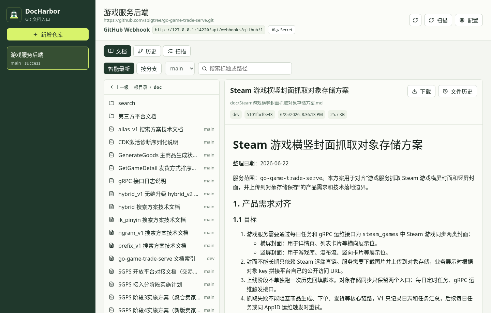
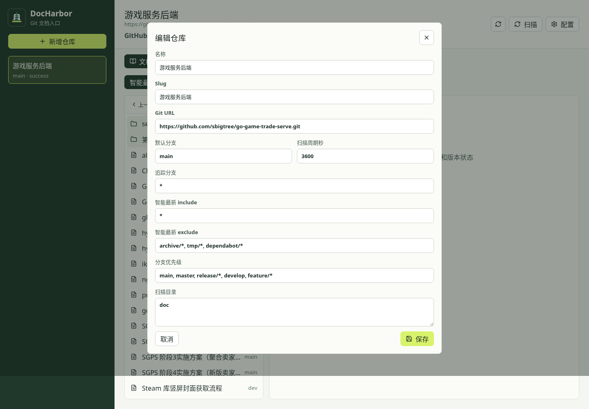
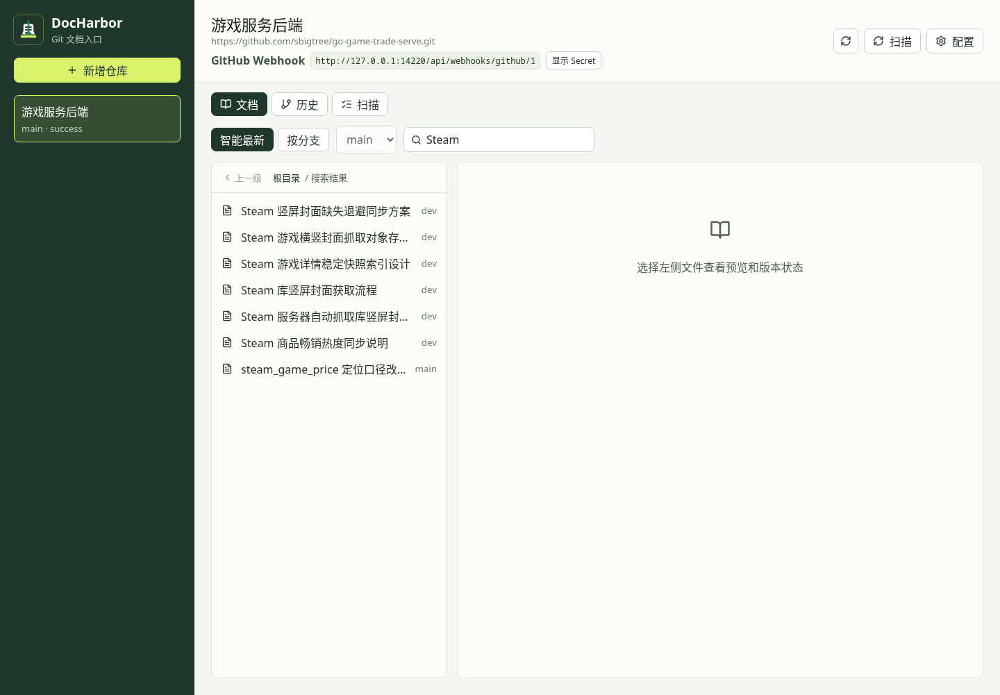
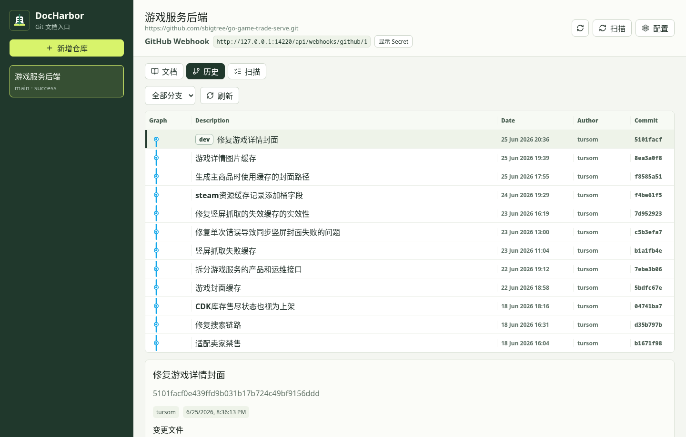
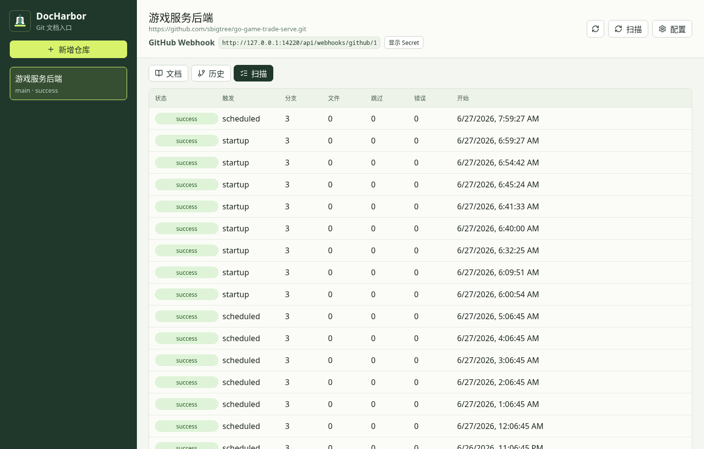
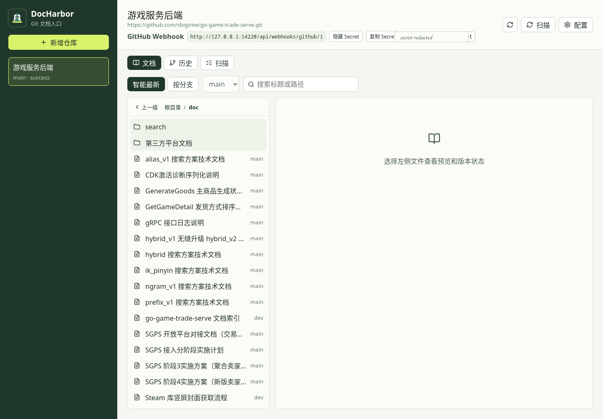

# DocHarbor 使用手册

DocHarbor 是一个面向 Git 仓库文档的浏览、预览、下载和历史查看工具。它不会接管文档编辑流程，也不会把文档写回仓库；Git 仍然是唯一可信来源，DocHarbor 只负责同步、索引和展示。

本文面向两类用户：

- 文档阅读者：查找、预览、下载文档，查看文档来源分支和最近变更。
- 仓库管理员：配置仓库、扫描目录、分支规则、GitHub Webhook 和部署访问控制。

## 1. 快速开始

### 1.1 启动服务

本地或服务器上可以直接使用 Docker Compose：

```bash
docker compose up --build -d
```

默认访问地址：

```text
http://127.0.0.1:14220
```

生产环境建议放在 Pangolin 等网关后面，由网关负责登录和访问控制。DocHarbor 自身不维护用户、角色和登录态。

### 1.2 首次使用流程

1. 点击左侧 **新增仓库**。
2. 填写仓库名称、Git URL、默认分支、扫描目录。
3. 保存后点击右上角 **扫描**。
4. 扫描完成后进入 **文档** 页签，通过目录、搜索或分支切换查看文档。
5. 需要自动刷新时，在 GitHub 配置 Webhook。

## 2. 界面概览

DocHarbor 的主界面分为三块：

- 左侧仓库列表：切换已配置仓库，查看默认分支和最近扫描状态。
- 顶部仓库信息：显示仓库 URL、GitHub Webhook URL、Secret 显示按钮、刷新、扫描和配置按钮。
- 主工作区：包含 **文档**、**历史**、**扫描** 三个页签。



## 3. 仓库配置

点击左侧 **新增仓库** 或右上角 **配置** 打开仓库配置弹窗。



### 3.1 字段说明

| 字段 | 说明 | 示例 |
| --- | --- | --- |
| 名称 | 页面上展示的仓库名称 | 游戏服务后端 |
| Slug | 仓库标识；为空时按名称生成 | game-docs |
| Git URL | Git 远程地址，支持 SSH 和 HTTP(S) | `git@github.com:org/repo.git` |
| 默认分支 | 文档页按分支浏览的默认分支 | `main` |
| 扫描周期秒 | 后台定时扫描间隔 | `3600` |
| 追踪分支 | 需要同步和扫描的分支，支持 `*` 和通配模式 | `*`、`main, release/*` |
| 智能最新 include | 参与智能最新计算的分支范围 | `*` |
| 智能最新 exclude | 从智能最新排除的分支 | `archive/*, tmp/*, dependabot/*` |
| 分支优先级 | 时间相同时的分支排序 | `main, master, release/*, develop` |
| 扫描目录 | 每行一个目录，只索引这些目录下的文件 | `doc`、`docs` |

### 3.2 分支规则怎么理解

- **追踪分支** 决定哪些分支会被扫描。
- **智能最新 include/exclude** 决定哪些分支参与“智能最新”视图。
- **分支优先级** 只在多个候选文档时间相同的时候生效。
- **按分支** 浏览不受智能最新规则影响，只要该分支被扫描，就可以查看该分支 HEAD 上的文档。

常见配置：

```text
追踪分支：*
智能最新 include：*
智能最新 exclude：archive/*, tmp/*, dependabot/*
分支优先级：main, master, release/*, develop, feature/*
扫描目录：doc
```

当前 UI 提供新增和编辑入口。后端 `DELETE /api/repos/{repoID}` 会将仓库置为停用状态，停用仓库不会继续扫描；当前页面没有单独的删除按钮，如需停用可以通过 API 或后续管理入口执行。

### 3.3 私有仓库凭据

DocHarbor 不把 Git 密钥写入数据库。凭据通过容器挂载或主机环境提供。

SSH 仓库：

- 默认 Compose 会挂载 `~/.ssh:/root/.ssh:ro`。
- 也可以把项目专用 deploy key 放到 `credentials/ssh/`，再用 `credentials/.gitconfig` 指定 `core.sshCommand`。

HTTP(S) 仓库：

- 使用 `~/.git-credentials` 或 `credentials/.git-credentials`。
- 使用 `credentials/.netrc`。
- 使用 `credentials/.gitconfig` 配置 credential helper。

示例：

```ini
[credential]
	helper = store --file /credentials/.git-credentials
```

## 4. 扫描仓库

保存仓库配置后，点击右上角 **扫描** 手动触发同步和扫描。

扫描会做这些事：

1. 首次执行 `git clone --mirror`。
2. 后续执行 `git remote update --prune`。
3. 读取追踪分支列表。
4. 对配置的扫描目录执行 Git tree 扫描。
5. 记录文档版本、来源分支、来源 commit、最近修改时间、文件状态和路径事件。
6. 重新计算智能最新索引。

后台也会按仓库配置的扫描周期定时扫描。启动服务时会执行一次 startup 扫描。

## 5. 浏览文档

进入 **文档** 页签后，可以用两种视图查看文件：

- **智能最新**：按文档维度从多个分支中选出最新有效版本。
- **按分支**：查看指定分支 HEAD 上的文档树。

### 5.1 目录导航

左侧文件区支持：

- 点击目录进入下一级。
- 点击 **上一级** 返回父目录。
- 点击面包屑里的任意一级目录快速跳转。
- 当前目录会写入浏览器地址，方便复制分享。

### 5.2 智能最新

智能最新不是简单展示某个分支的文件树，而是按每个文档选择候选版本：

- 只选择当前仍然存在的 active 文件。
- 优先选择文件自己的最近修改时间更晚的版本。
- 时间相同时参考分支优先级。
- 排除 `latest_exclude_branches` 命中的分支。

文件行右侧会显示来源分支，文件详情顶部会显示来源 commit、时间和大小。

### 5.3 按分支浏览

切换到 **按分支** 后，选择分支下拉框即可查看该分支上的文档。这个模式适合查看测试分支、发布分支或历史维护分支上的文档状态。

## 6. 搜索文档

在文档页顶部搜索框输入关键词并按回车，可以按标题和路径搜索当前仓库的文档。



搜索结果会显示在左侧文件区，面包屑中会显示 **搜索结果**。清空搜索词并回车，或重新进入目录，可以回到普通目录浏览。

## 7. 预览和下载

点击左侧文件后，右侧会打开文件详情。

支持预览：

- Markdown 文件。
- Markdown 内的 Mermaid 代码块。
- Markdown 内的相对图片资源；相对路径会按当前文档所在目录解析，并从同一个 commit 的 Git 对象中读取。

支持下载：

- 所有被索引且允许下载的文件。
- 非 Markdown 文件首期不预览，但仍可以通过 **下载** 按钮下载。
- Markdown 超过预览大小限制时不会预览，但仍可以下载。

文件详情展示：

- 标题和路径。
- 来源分支。
- 来源 commit。
- 最近修改时间。
- 文件大小。
- 分支状态。
- 删除、移动、重命名等路径事件。

浏览器地址会同步当前 repo、视图、目录和版本 ID。复制地址给别人后，对方可以直接定位到同一个文档。

## 8. 文件历史和路径事件

文档详情底部包含两块信息：

- **分支状态**：同一文档在不同分支上的状态和路径。
- **路径事件**：扫描识别到的删除、移动、重命名事件。

点击 **文件历史** 会重新加载当前文档的历史信息。首期文件历史主要展示分支状态和路径事件，不提供在线 diff。

## 9. Git 历史

进入 **历史** 页签可以查看仓库级提交历史。



功能说明：

- 默认显示 **全部分支** 的提交历史。
- 选择具体分支后，只显示该分支历史。
- 左侧 Graph 列展示提交线。
- Description 列展示提交信息和分支/tag 标记。
- 点击提交行后，下方展示 commit sha、作者、时间和变更文件列表。
- 历史页的分支选择也会写入浏览器地址，方便分享。

## 10. 扫描记录

进入 **扫描** 页签可以查看最近扫描记录。



字段说明：

| 字段 | 说明 |
| --- | --- |
| 状态 | `success`、`failed` 等扫描结果 |
| 触发 | `startup`、`scheduled`、`manual`、`github_webhook` |
| 分支 | 本次扫描处理的分支数量 |
| 文件 | 本次扫描写入或处理的文件数量 |
| 跳过 | 因规则或文件状态跳过的数量 |
| 错误 | 扫描中遇到的文件级错误数量 |
| 开始 | 扫描开始时间 |

如果扫描失败，仓库列表和扫描记录会显示错误状态。优先检查 Git URL、凭据、允许的 Git host、扫描目录和网络连通性。

## 11. GitHub Webhook

DocHarbor 支持 GitHub Webhook 自动触发扫描。每个仓库都有独立 URL：

```text
https://<你的域名>/api/webhooks/github/<repoID>
```

页面顶部会显示当前仓库的 webhook URL。



### 11.1 配置服务端 Secret

启动服务时设置共享 secret：

```bash
GITHUB_WEBHOOK_SECRET=your-random-secret docker compose up --build -d
```

所有仓库共享这一个 secret。为空时 webhook 入口不可用。

### 11.2 在 GitHub 仓库配置 Webhook

在 GitHub 仓库进入 `Settings -> Webhooks -> Add webhook`：

| 字段 | 值 |
| --- | --- |
| Payload URL | `https://<你的域名>/api/webhooks/github/<repoID>` |
| Content type | `application/json` |
| Secret | 与 `GITHUB_WEBHOOK_SECRET` 一致 |
| Events | `Just the push event` |

GitHub 的 `ping` 事件用于测试连通性；`push` 事件会异步触发扫描并立即返回 `202 Accepted`。

### 11.3 在 UI 显示和复制 Secret

点击页面顶部的 **显示 Secret**，DocHarbor 会从后端读取当前部署环境中的 `GITHUB_WEBHOOK_SECRET` 并明文展示。点击 **复制 Secret** 可复制到剪贴板。

注意：DocHarbor 自身没有用户权限系统，显示 Secret 的能力必须依赖 Pangolin 或其他外层访问控制保护。

### 11.4 Pangolin 路径放行

GitHub Webhook 请求不会携带 Pangolin 登录态，所以 webhook 路径必须 **旁路认证**。

推荐规则：

```text
规则 1：
路径：/api/webhooks/github/secret
行为：传递至认证

规则 2：
路径：/api/webhooks/github/*
行为：旁路认证
```

如果 Pangolin 路径输入框不接受开头 `/`，就写：

```text
api/webhooks/github/secret
api/webhooks/github/*
```

规则 1 必须排在规则 2 前面，避免 `secret` 接口被公开。也可以不用通配符，逐个仓库精确放行：

```text
/api/webhooks/github/1
/api/webhooks/github/2
```

## 12. 浏览器地址和分享

DocHarbor 会把主要浏览状态写入 URL：

| 参数 | 说明 |
| --- | --- |
| `repo` | 仓库 ID |
| `tab` | `docs`、`history`、`runs` |
| `view` | `latest` 或 `branch` |
| `branch` | 当前分支过滤 |
| `dir` | 当前目录 |
| `version` | 当前打开的文档版本 |

常见分享方式：

- 分享文档：打开目标文件后复制浏览器地址。
- 分享目录：进入目标目录后复制地址。
- 分享某个分支视图：切到按分支并选择分支后复制地址。
- 分享 Git 历史过滤：进入历史页并选择分支后复制地址。

## 13. 部署和运行配置

### 13.1 Docker Compose

```bash
docker compose up --build -d
```

当前 Compose 默认监听：

```text
http://127.0.0.1:14220
```

如果使用 GHCR 镜像，也可以直接拉取：

```bash
docker pull ghcr.io/tursom/doc-harbor:latest
```

### 13.2 常用环境变量

| 环境变量 | 默认值 | 说明 |
| --- | --- | --- |
| `DATA_DIR` | `./data` | SQLite 和 bare mirror 数据目录 |
| `HTTP_ADDR` | `:8080` | HTTP 监听地址；Compose 中为 `:14220` |
| `DB_DSN` | `${DATA_DIR}/doc-harbor.db` | SQLite DSN |
| `GIT_BIN` | `git` | Git 命令路径 |
| `WEB_DIR` | `./web/dist` | 静态前端目录 |
| `DEFAULT_SCAN_INTERVAL` | `3600` | 默认扫描间隔秒数 |
| `MAX_PREVIEW_FILE_SIZE` | `2097152` | Markdown 预览大小上限 |
| `ALLOWED_GIT_HOSTS` | 空 | Git host 白名单，逗号分隔；空表示不限制 |
| `ALLOW_LOCAL_GIT` | `0` | 是否允许本地路径或 `file://` 仓库 |
| `GITHUB_WEBHOOK_SECRET` | 空 | GitHub Webhook 共享 secret |

### 13.3 数据和凭据挂载

Compose 默认挂载：

```text
./data:/data
~/.ssh:/root/.ssh:ro
./credentials:/credentials:ro
~/.git-credentials:/root/.git-credentials:ro
~/.gitconfig:/root/.gitconfig:ro
```

建议：

- `./data` 需要持久化备份。
- `credentials/` 不要提交真实凭据。
- 生产环境使用只读 deploy key 或专用 token。
- 如果使用 HTTP(S) Git，确认 `.git-credentials` 或 `.netrc` 在容器内可读。

## 14. 安全边界

DocHarbor 的安全边界是：

- 不内建用户系统。
- 不内建页面权限。
- 访问控制交给 Pangolin 或其他反向代理。
- GitHub Webhook 通过 HMAC-SHA256 校验 `X-Hub-Signature-256`。
- 默认禁止本地 Git URL，避免任意本机路径 clone。
- Markdown HTML 会在前端 sanitize 后渲染。
- Mermaid 渲染失败时降级为原始代码块。

必须保护的路径：

```text
/api/webhooks/github/secret
```

必须旁路认证的路径：

```text
/api/webhooks/github/<repoID>
```

## 15. 故障排查

### 15.1 仓库 clone 或 fetch 失败

检查：

- Git URL 是否正确。
- 容器内是否能解析和访问 Git host。
- SSH key 是否挂载到 `/root/.ssh`。
- HTTP(S) token 是否挂载到 `/root/.git-credentials` 或 `/credentials/.netrc`。
- `ALLOWED_GIT_HOSTS` 是否包含目标 host。
- 本地路径或 `file://` 是否被 `ALLOW_LOCAL_GIT=0` 拦截。

### 15.2 文档列表为空

检查：

- 是否点击过 **扫描**。
- 扫描目录是否写对，例如 `doc` 和 `docs` 不同。
- 追踪分支是否匹配实际分支。
- 文件是否在扫描目录下。
- 文件是否被隐藏目录、临时文件规则或大小限制跳过。
- 智能最新是否被 include/exclude 规则排除了。

### 15.3 Markdown 不预览

检查：

- 文件扩展名是否为 Markdown。
- 文件大小是否超过 `MAX_PREVIEW_FILE_SIZE`。
- 右侧是否显示“当前文件不支持预览”。如果显示，仍可使用下载。

### 15.4 Mermaid 渲染失败

Mermaid 代码块语法错误时，DocHarbor 会保留原始代码块并显示错误。先把 Mermaid 片段放到 Mermaid Live Editor 或本地工具中校验语法，再提交到 Git。

### 15.5 GitHub Webhook 不触发扫描

检查：

- `GITHUB_WEBHOOK_SECRET` 是否配置。
- GitHub Webhook Secret 是否和服务端一致。
- GitHub Webhook Content type 是否为 `application/json`。
- GitHub 事件是否选择了 push。
- Pangolin 是否对 `/api/webhooks/github/<repoID>` 设置了旁路认证。
- Pangolin 是否仍然保护 `/api/webhooks/github/secret`。
- 扫描记录里是否出现 `github_webhook`。

### 15.6 页面能打开但分享链接定位不对

检查链接里是否包含：

- `repo=<id>`
- `tab=docs|history|runs`
- `view=latest|branch`
- `dir=<目录>`
- `version=<文档版本 ID>`

如果仓库被停用、文档版本被重新索引或数据目录被重建，旧链接可能无法定位到同一个版本。

## 16. API 和自动化能力

DocHarbor 的 UI 使用同一组 HTTP API。自动化脚本可以直接调用这些接口，但仍需要通过 Pangolin 或部署侧网络策略控制访问。

常用接口：

| 方法 | 路径 | 说明 |
| --- | --- | --- |
| `GET` | `/api/health` | 健康检查 |
| `GET` | `/api/repos` | 仓库列表 |
| `POST` | `/api/repos` | 新增仓库 |
| `PATCH` | `/api/repos/{repoID}` | 更新仓库配置 |
| `DELETE` | `/api/repos/{repoID}` | 停用仓库 |
| `POST` | `/api/repos/{repoID}/scan` | 手动扫描 |
| `GET` | `/api/repos/{repoID}/branches` | 已扫描分支 |
| `GET` | `/api/repos/{repoID}/files` | 当前目录文件列表 |
| `GET` | `/api/repos/{repoID}/search` | 搜索文档 |
| `GET` | `/api/repos/{repoID}/versions/{versionID}/content` | 文档预览内容 |
| `GET` | `/api/repos/{repoID}/versions/{versionID}/download` | 下载已索引版本 |
| `GET` | `/api/repos/{repoID}/history` | 仓库 Git 历史 |
| `GET` | `/api/repos/{repoID}/commits/{sha}` | commit 详情和变更文件 |
| `GET` | `/api/repos/{repoID}/scan-runs` | 扫描记录 |
| `POST` | `/api/webhooks/github/{repoID}` | GitHub Webhook |

构建发布：

- 仓库包含 GitHub Actions 工作流，push 到 `master` 或 `v*` tag 会构建并推送 `ghcr.io/tursom/doc-harbor`。
- `master` 分支会生成 `latest`、`master`、`sha-<shortsha>` 标签。
- `v*` tag 会生成对应版本标签。
- `docker-compose.yml` 同时保留 `build: .` 和 `image: ghcr.io/tursom/doc-harbor:latest`，既可本地构建，也可使用 GHCR 镜像名称。

## 17. 当前限制

- 不支持在线编辑文档。
- 不支持目录打包 zip 下载。
- 不支持评论、审批、收藏等协作功能。
- 不支持内置用户权限；必须依赖外层网关。
- 非 Markdown 文件首期只下载，不做在线预览。
- 智能最新主要按规范化路径识别文档身份，rename/move 事件用于历史展示和后续增强。
