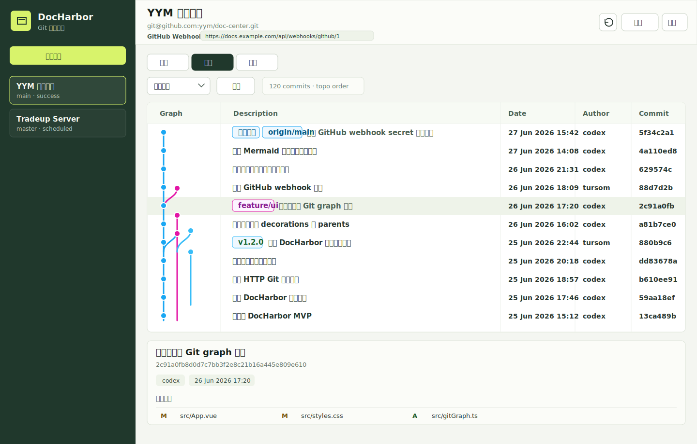

# Git 历史图 UI 设计

## 目标

把当前“提交列表 + 右侧详情”的历史页升级为适配 DocHarbor 界面的 Git graph 表格，让用户能同时看清提交拓扑、分支/tag 标记、提交说明、时间、作者和短 SHA。

下面的原型图是预期落到 DocHarbor 后的界面效果预览，不是对参考截图的复刻：

## 当前状态

当前历史页已经具备基础数据和交互：

- 后端 `GET /api/repos/:repo_id/history` 基于 `git log --topo-order --decorate --parents` 返回 commit 列表。
- 前端 `CommitSummary` 已包含 `sha`、`parents`、`author`、`author_email`、`commit_time`、`decorations`、`message`。
- 点击 commit 后通过 `GET /api/repos/:repo_id/commits/:sha` 展示变更文件列表。

因此 v1 不需要改后端，可以先在前端计算 graph lane 并渲染表格。

## 信息架构

历史页保留顶部工具栏：

- 分支选择，默认是“全部分支”，只在用户主动选择分支时过滤。
- 刷新按钮。
- 后续可增加提交数量限制。

主区域改为上下结构：

- 上方为 Git graph 表格，占主要空间。
- 下方或右侧保留 commit 详情，点击表格行后展示变更文件。

表格列：

| 列 | 内容 | 说明 |
| --- | --- | --- |
| Graph | 提交点、纵向线、分叉线、合并线 | 固定宽度，根据 lane 数量横向扩展 |
| Description | branch/tag badge + commit message | 长文本单行省略，hover 可看完整内容 |
| Date | commit time | 使用当前 `formatTime`，桌面可更接近 `26 Jun 2026 11:47` |
| Author | author | 单行省略 |
| Commit | 8 位短 SHA | 等宽字体，点击行时同步详情 |

## 视觉方案

- 外层沿用 DocHarbor 当前浅色工作区和深绿色侧边栏。
- Git graph 表格本身使用白底区域，和当前 DocHarbor 列表、表格保持一致。
- 表头固定，行高约 `38px`。
- 选中行使用深灰高亮。
- 主线使用蓝色，分支线按 lane 分配颜色：蓝、洋红、青、黄、绿。
- branch/tag/stash 使用浅色 badge：
  - branch：线条同色边框，浅色底。
  - tag：可使用更亮的蓝色边框。
  - stash：洋红色边框。
- merge commit 的文字可降一级对比度，但仍可点击。

## 交互设计

- 点击行：选中 commit，加载并展示现有 commit 详情。
- 双击或点击短 SHA：后续可复制完整 SHA，v1 可不做。
- 鼠标悬停：
  - Description 显示完整 message 和 decorations。
  - Commit 显示完整 SHA。
  - Graph 点显示 parent commits。
- 分支切换后重新加载 history，并清空当前选中 commit；切回“全部分支”时展示全仓库拓扑。
- 空数据时显示当前已有空状态风格。

## Graph lane 计算

v1 在前端根据当前返回的 `commits` 计算，不扩展 API：

1. 按返回顺序处理 commit，返回顺序已是 topo-order。
2. 维护 active lanes：每个 lane 记录当前应连接到的 sha。
3. 当前 commit 如果已在 active lanes 中，使用对应 lane；否则分配第一个空 lane。
4. 当前 commit 渲染：
   - 在当前 lane 画提交点。
   - 所有 active lanes 画纵向线。
   - 对每个 parent 更新 active lane；第一个 parent 复用当前 lane，额外 parent 分配或连接到其他 lane。
5. 对列表中找不到的 parent 只保留纵向延伸到当前窗口底部，不强行补节点。

该算法覆盖常见线性历史、分支、merge。复杂 octopus merge 或过多 lane 先保证不崩，图线可以降级为简化连接。

## 实施拆分

建议分两步实现：

1. 表格和视觉替换
   - 新增 `graphRows` computed，把 commit 列表转成包含 lane、线段、badge 的渲染模型。
   - 替换当前 `.commit-list` 为 graph table。
   - 保留现有 commit detail 区域和 `openCommit` 流程。

2. 交互增强
   - branch/tag/stash decoration 解析为 badge。
   - hover tooltip。
   - 窄屏下隐藏 Date/Author 或改为行内 meta。
   - 复制短 SHA/完整 SHA。

## 验收标准

- 线性提交能显示连续主线。
- merge commit 能显示至少两条 lane 的连接关系。
- 分支/tag 标记能显示在 Description 前。
- 点击行仍能加载现有 commit 详情和变更文件。
- `npm run build` 通过。
- 不改变现有 history 和 commit 详情 API。

## 风险和边界

- 前端 lane 算法基于当前 `limit` 窗口，窗口外 parent 无法完整画出，只做延伸线。
- decorations 是 Git 输出字符串，v1 需要做轻量解析，遇到未知格式按普通 badge 展示。
- 如果仓库分支很多，Graph 列可能横向变宽，需要表格横向滚动。
